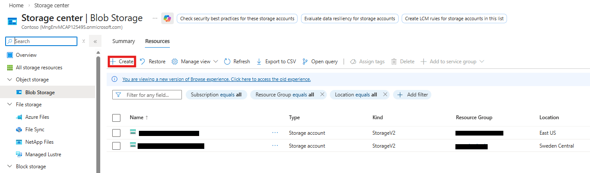
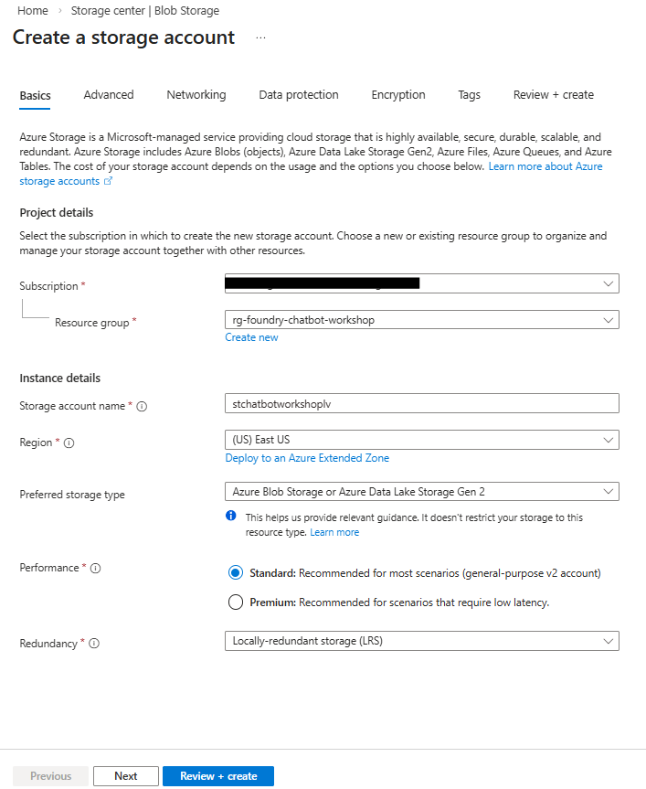
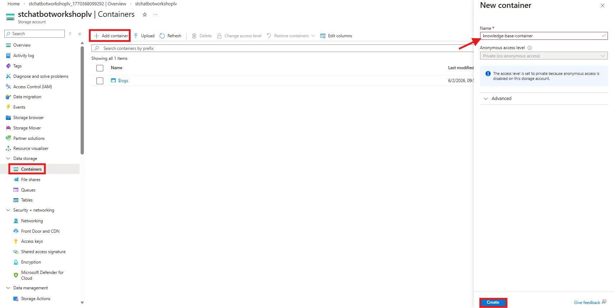

# Sub-Lab 1.2: Prepare Your Knowledge Base

[← Back to Lab 1 Overview](./README.md) | [← Previous: Sub-Lab 1.1](./sub-lab-1.1-setup-azure-resources.md) | [Next: Sub-Lab 1.3 →](./sub-lab-1.3-create-vector-index.md)

---

**⏱️ Estimated Time**: 10-15 minutes

## Overview

In this sub-lab, you'll upload your documents to Azure Blob Storage. These documents become the knowledge base that your chatbot can search and reference when answering questions.

---

## 🎓 Key Concepts

### What is Azure Blob Storage?

Azure Blob Storage is Microsoft's object storage solution for the cloud:
- **Blobs**: Binary Large Objects - any type of file
- **Containers**: Logical groupings of blobs (like folders)
- **Storage Account**: Top-level namespace for your data

### Why Blob Storage for RAG?

1. **Scalable**: Handle any amount of documents
2. **Integrated**: Works seamlessly with Azure AI Search
3. **Secure**: Fine-grained access control
4. **Cost-effective**: Pay only for what you store

### Sample Documents

The `data/knowledge_base/` folder contains sample documents:

| File | Contents |
|------|----------|
| `company_info.txt` | Company name, founding date, products, contact info |
| `policies.txt` | Return policy, shipping options, support channels |

---

## Resources You'll Create

- **Storage Account**: For storing your documents
- **Blob Container**: Organized storage for knowledge base files
- **Documents**: Sample files for the chatbot to learn from

---

## Instructions

> ✏️ **Replace [yourname]** with your actual name or identifier (e.g., `jsmith`) throughout these instructions. Use the same value you chose in sub-lab 1.1.

### 1. Create a Storage Account

1. Go to [Azure Portal](https://portal.azure.com)
2. Search for "Storage accounts" → Click "Create"

   

3. Configure:
   - **Resource group**: `rg-foundry-workshop-[yourname]`
   - **Storage account name**: `stchatbot[yourname]` (must be globally unique, lowercase, no special characters)
   - **Region**: East US 2
   - **Performance**: Standard
   - **Redundancy**: Locally-redundant storage (LRS)
4. Click "Review + Create" → "Create"

   

### 2. Create a Blob Container

1. Go to your new storage account (Click "Go to resource")
2. In the left menu, click "Containers" under "Data storage"
3. Click "+ Container"
4. Configure:
   - **Name**: `knowledge-base-container`
   - **Anonymous access level**: Private
5. Click "Create"

   

### 3. Upload Your Documents

1. Click on your `knowledge-base-container`

> ⚠️ **Warning: Permissions Error?**
>
> If you see: *"You do not have permissions to list the data using your user account with Microsoft Entra ID..."*
>
> 
>
> **Solution - Grant yourself data plane permissions:**
>
> 1. Go to **Access Control (IAM)** on your storage account
> 2. Click **Add** → **Add role assignment**
> 3. Choose role: **"Storage Blob Data Contributor"**
> 4. Press **Next**
> 5. Select **"User, group, or service principal"**
> 6. Click **"Select members"** → Select yourself
> 7. Click **Review + assign** (twice)
>
> If you still are not able to upload, log out and back in, then retry the upload.

2. Click "Upload"
3. Select files from the `data/knowledge_base/` folder:
   - `company_info.txt`
   - `policies.txt`
4. Click "Upload"

   

### ✅ Checkpoint

You should now have:
- [ ] Storage account: `stchatbot[yourname]`
- [ ] Container: `knowledge-base-container`
- [ ] Uploaded documents (company_info.txt, policies.txt)

---

[← Back to Lab 1 Overview](./README.md) | [← Previous: Sub-Lab 1.1](./sub-lab-1.1-setup-azure-resources.md) | [Next: Sub-Lab 1.3 →](./sub-lab-1.3-create-vector-index.md)
