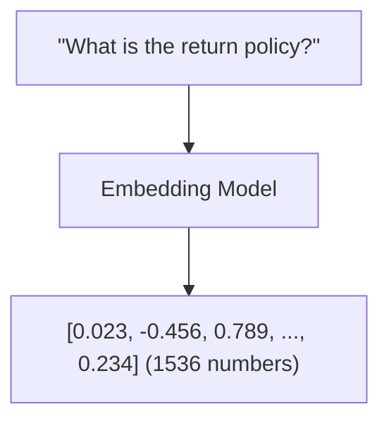
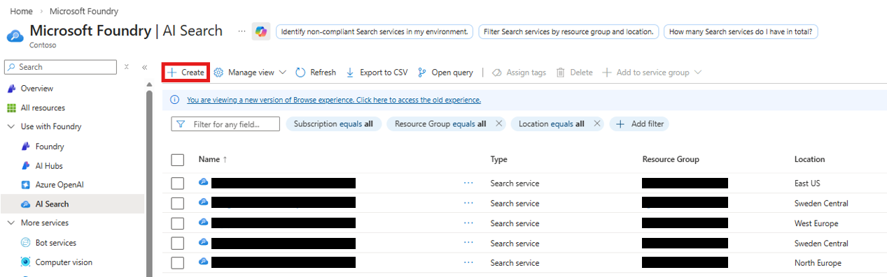
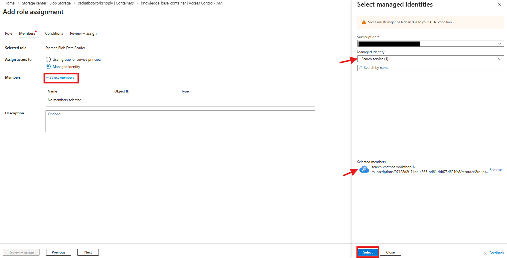
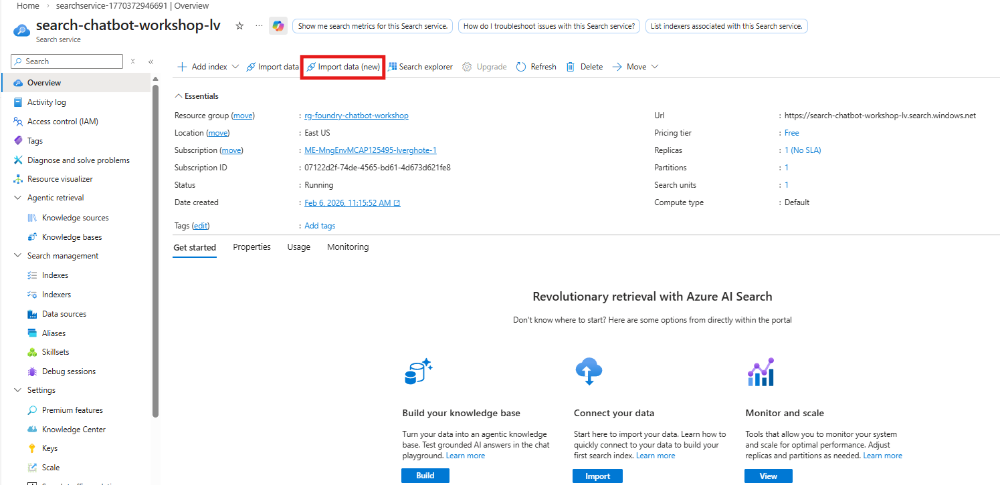

# Sub-Lab 1.3: Create Vector Index

[← Back to Lab 1 Overview](./README.md) | [← Previous: Sub-Lab 1.2](./sub-lab-1.2-prepare-knowledge-base.md) | [Next: Sub-Lab 1.4 →](./sub-lab-1.4-create-agent.md)

---

**⏱️ Estimated Time**: 15-20 minutes

## Overview

In this sub-lab, you'll create a vector index in Azure AI Search. This index stores embeddings (numerical representations) of your documents, enabling the chatbot to find relevant information based on meaning rather than just keywords.

You'll also configure the necessary permissions so AI Search can read your documents from Blob Storage and use the embedding model from Foundry.

---

## 🎓 Key Concepts

### What is a Vector Index?

A vector index stores numerical representations (embeddings) of your documents:
- **Embeddings**: Dense vectors (e.g., 1536 dimensions) that capture semantic meaning
- **Vector Search**: Find similar documents based on meaning, not just keywords
- **HNSW Algorithm**: Efficient approximate nearest neighbor search

### How Embeddings Work

Similar meanings → Similar vectors → Found together in search

### Example

These questions have different words but similar meanings:
- "How do I return a product?"
- "What's your refund policy?"
- "Can I get my money back?"

The embedding model understands this similarity!

### Index Schema

Our index has these fields:
| Field | Type | Purpose |
|-------|------|---------|
| `id` | String | Unique identifier for each chunk |
| `content` | String | The actual text content |
| `source` | String | Original document name |
| `embedding` | Vector (1536) | Numerical representation |

---

## Resources You'll Create

- **Azure AI Search Service**: Search infrastructure
- **Vector Index**: Searchable index with embeddings
- **Role Assignments**: Permissions for AI Search to access Storage and Foundry

---

## Instructions

> ✏️ **Replace [yourname]** with your actual name or identifier (e.g., `jsmith`) throughout these instructions. Use the same value you chose in sub-lab 1.1.

### 1. Create Azure AI Search Service

1. Go to [Azure Portal](https://portal.azure.com)
2. Search for "Azure AI Search" → Click "Create"

   

3. Configure:
   - **Resource group**: `rg-foundry-workshop-[yourname]`
   - **Service name**: `search-chatbot-[yourname]` (must be globally unique)
   - **Location**: East US 2
   - **Pricing tier**: Free (sufficient for workshop)
4. Click "Review + Create" → "Create"

   
   
5. Wait for the AI Search to be deployed. This can take 5-10 minutes.

### 2. Grant AI Search Access to Storage

Your AI Search service needs permission to read documents from Blob Storage.

1. Go to your **Storage Account** → Access Control (IAM)
2. Click **Add** → **Add role assignment**
3. Select role: **Storage Blob Data Reader**
4. Click **Next**
5. Select **Managed identity**
6. Click **Select members**
7. Under "Managed identity", choose **Search service**
8. Select: `search-chatbot-[yourname]` (If you don't see this between the options yet, wait 5-10 more minutes)
9. Click **Select** → **Review + assign** (twice)

   

### 3. Grant AI Search Access to Foundry

Your AI Search service needs permission to use the embedding model.

1. Go to your **Foundry resource** → Access Control (IAM)
2. Click **Add** → **Add role assignment**

   

3. Select role: **Cognitive Services OpenAI User**
4. Click **Next**
5. Select **Managed identity** → **Select members**
6. Choose **Search service** → Select: `search-chatbot-[yourname]`
7. Click **Select** → **Review + assign** (twice)

### 4. Import and Index Your Data

1. Go to your AI Search resource
2. Click **"Import data (new)"**

   

3. **Configure data source**:
   - **Data source**: Azure Blob Storage
   - **Use case**: RAG
   - **Storage account**: `stchatbot[yourname]`
   - **Container**: `knowledge-base-container`
4. Click **Next**

5. **Configure embeddings**:
   - **Kind**: Microsoft Foundry
   - **Hub project**: Select your project (`my-first-chatbot`)
   - **Model deployment**: `text-embedding-3-small`
   - ✅ Check: "I acknowledge..."
6. Click **Next** → **Next** → **Next** → **Create**

### 5. Wait for Indexing

- The indexing process takes 2-5 minutes
- Monitor progress in the Search service → Indexes section
- Once complete, you'll see document count and status

### ✅ Checkpoint

You should now have:
- [ ] Azure AI Search service: `search-chatbot-[yourname]`
- [ ] Vector index with your documents
- [ ] Proper role assignments for Search to access Storage and Foundry

---

[← Back to Lab 1 Overview](./README.md) | [← Previous: Sub-Lab 1.2](./sub-lab-1.2-prepare-knowledge-base.md) | [Next: Sub-Lab 1.4 →](./sub-lab-1.4-create-agent.md)
