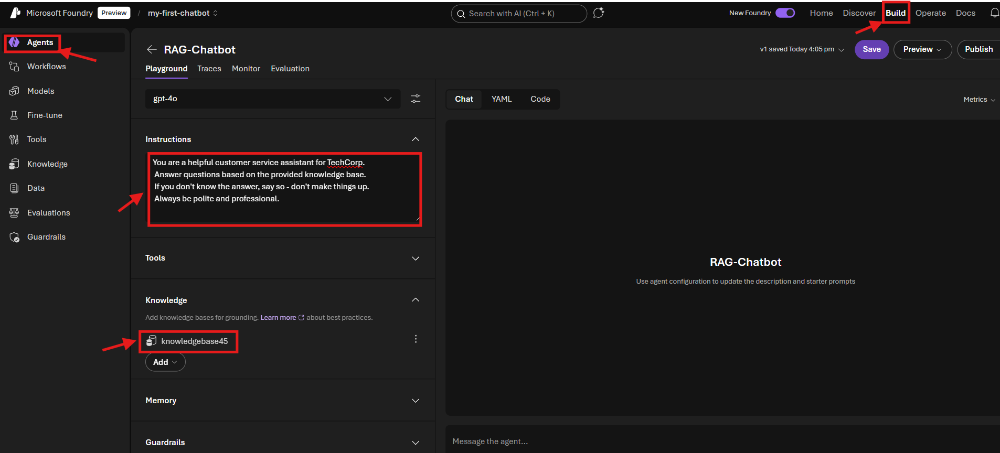
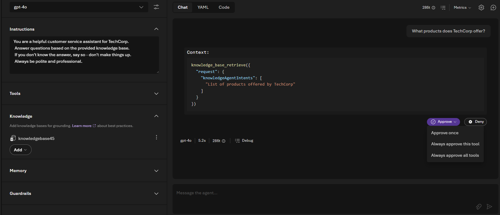

# Sub-Lab 1.4: Create Your Agent in Foundry

[← Back to Lab 1 Overview](./README.md) | [← Previous: Sub-Lab 1.3](./sub-lab-1.3-create-vector-index.md)

---

**⏱️ Estimated Time**: 15-20 minutes

## Overview

In this sub-lab, you'll create an AI agent in Microsoft Foundry that uses your vector index to answer questions. The agent combines your chat model (e.g., GPT-4.1-mini) with your indexed documents to provide accurate, context-aware responses.

---

## 🎓 Key Concepts

### What is Foundry IQ?

Foundry IQ is a managed knowledge layer that connects your enterprise data to AI agents. It provides:
- **Multi-source knowledge bases**: Connect Azure Blob Storage, SharePoint, OneLake, and web data
- **Agentic retrieval**: Automatically decomposes complex questions into subqueries, executes them in parallel, and aggregates results
- **Permission-aware responses**: Enforces access control so agents only return content users are authorized to see
- **Grounded answers with citations**: Returns extractive data with sources so agents can trace answers back to documents

### What is a Foundry Agent?

A Foundry Agent is an AI-powered assistant that can:
- **Understand** natural language questions
- **Search** your knowledge base for relevant information
- **Generate** accurate responses based on your documents
- **Cite** sources so users know where answers come from

### How the Agent Uses Foundry IQ

When a user asks a question:
1. The agent sends the question to Foundry IQ
2. Foundry IQ uses agentic retrieval to search your indexed content
3. Relevant chunks are returned with citations
4. Your chat model generates a response grounded in your documents

---

## Instructions

### 1. Navigate to Foundry Portal

1. Go back to [Microsoft Foundry](https://ai.azure.com)
2. Select your project (`my-first-chatbot`)

### 2. Create a Foundry IQ connection

1. In the top menu, go to Build
2. Go to "Knowledge" on the left
3. Connect to an AI Search resource by selecting your index at the bottom. This allows Foundry IQ to intelligently search between different knowledge sources in the knowledge base
4. choose API Key as the Auth Type. 
5. Press connect

   

### 3. Create a knowledge base in Foundry IQ

1. Click "Create a knowledge base"
2. Choose Azure AI Search Index (under "Configure a knowledge base")
3. Give a description: e.g. `Contains company info and policies`
4. Select the `rag-XXXX` option you see under "Select search index"
5. Select a chat completions model: `gpt-4.1-mini` (or `gpt-4.1`, `gpt-4o` if you deployed a different model in Sub-Lab 1.1)
5. Click Save "knowledge base"  on the top right

### 4. Create an agent
1. Go to Build -> Agents 
2. Click "Create agent"
3. Give the agent a name, e.g. `RAG-Chatbot`
4. Add instructions to the agent:
     ```
     You are a helpful customer service assistant for TechCorp. 
     Answer questions based on the provided knowledge base. 
     If you don't know the answer, say so - don't make things up.
     Always be polite and professional.
     ```
5. Click "Knowledge" and then "Add" and then Connect ot Foundry IQ
6. Select the knowledge base in the list and then "Connect".
   
7. Press "Save" on the top right
    


### 5. Test Your Agent

1. In the agent view, find the **Test** panel (usually on the right)
2. Try these questions:

**Test Questions:**
```
What products does TechCorp offer?
```
```
What is the return policy?
```
```
What are the shipping options and costs?
```
```
How can I contact customer support?
```
3. Your Agent will ask you to retrieve context from the knowledge base
    

4. The agent will provide an answer based on the info in the knowledge base: 
    

### Expected Results

The agent should:
- ✅ Return accurate information from your documents
- ✅ Cite or reference sources when answering
- ✅ Acknowledge when information isn't available
- ✅ Stay within the scope of your knowledge base

**Example Response:**
> Based on the knowledge base, TechCorp offers three main products:
> 1. **SmartAssist** - An AI customer service platform
> 2. **DataVision** - Business intelligence and analytics
> 3. **CloudSync** - Multi-cloud data synchronization
>
> *Source: company_info.txt*

### 6. Publish the Agent (Optional)

Once you're satisfied with the agent's responses:

1. Click **Publish** on the top right (and then publish and publish)
2. Your agent will now return a:
   - **Activity Protocol endpoint**: 
   - **Responses API endpoint**: For integration with your own applications

When you publish an agent, Microsoft Foundry creates an Agent Application resource with a dedicated invocation URL and its own Microsoft Entra agent identity blueprint and agent identity. A deployment is created under the application that references your agent version and registers it in the Entra Agent Registry for discovery and governance.

Publishing enables you to share agents with teammates, your organization, or customers without granting access to your Foundry project or source code. The stable endpoint remains consistent as you iterate and deploy new agent versions.

### ✅ Checkpoint

You should now have:
- [ ] Agent created in Foundry
- [ ] Knowledge base (AI Search index) connected
- [ ] Agent responds accurately to test questions
- [ ] (Optional) Agent deployed for production use

---

[← Back to Lab 1 Overview](./README.md) | [← Previous: Sub-Lab 1.3](./sub-lab-1.3-create-vector-index.md)
