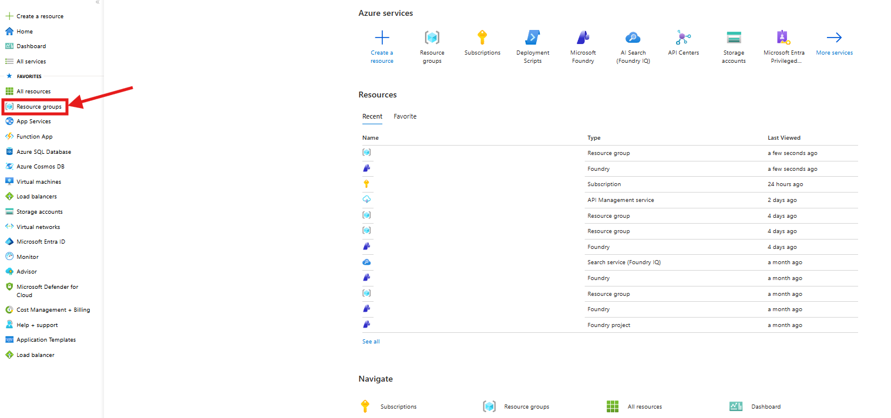
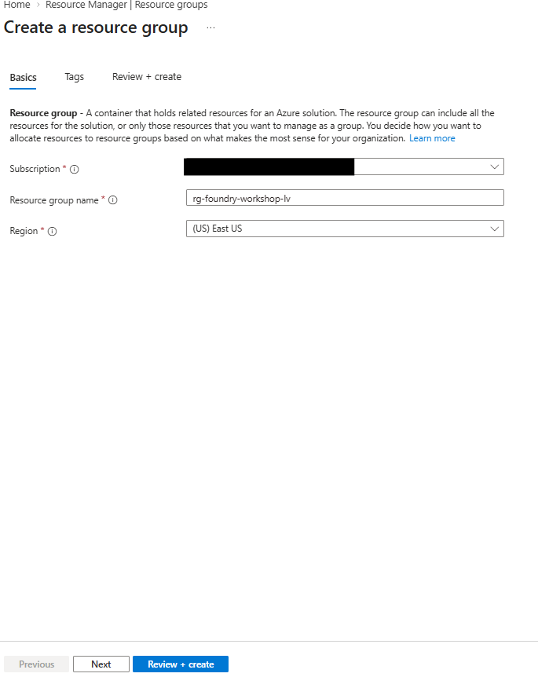
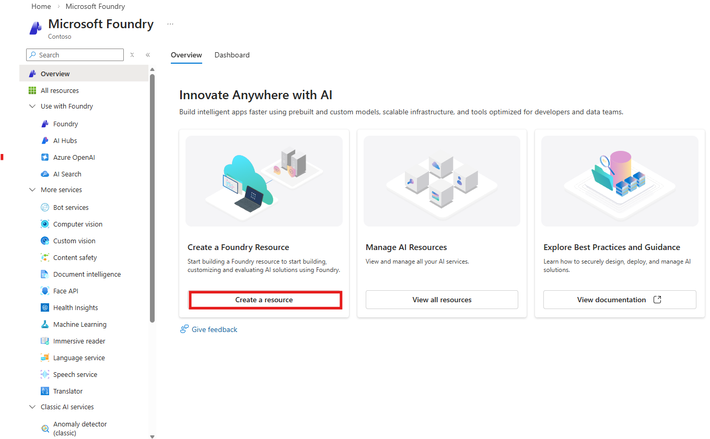
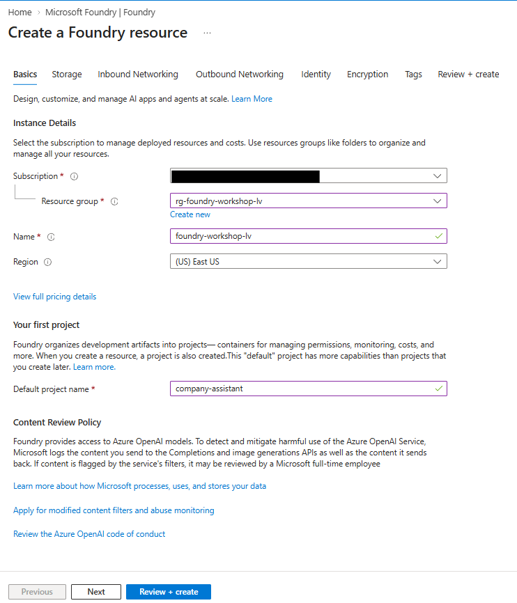
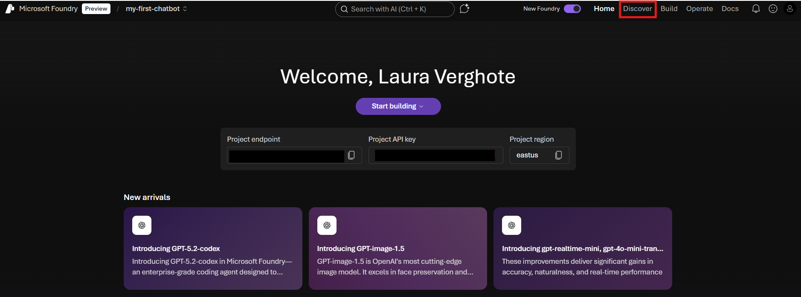
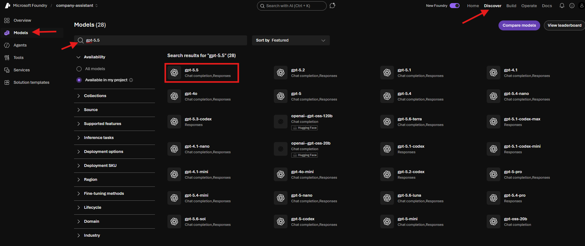

# Lab 1: Set Up Azure Resources

[← Back to Workshop Overview](./README.md) | [Next: Lab 2 →](./lab-2-create-knowledge-base.md)

---

**⏱️ Estimated Time**: 15-20 minutes

## Overview

In this lab, you'll set up Microsoft Foundry and deploy the AI models that power your agent.

---

## 🎓 Key Concepts

### What is Microsoft Foundry?

Microsoft Foundry is a unified AI platform that provides:
- **Project Management**: Organize your AI resources and deployments
- **Model Catalog**: Access to GPT, embedding, and other AI models
- **Development Tools**: Build, test, and deploy AI applications
- **Monitoring**: Track usage, costs, and performance

### What are Model Deployments?

A deployment is an instance of a model that you can call via API. In this workshop we'll deploy two models:

| Type | Model | What it does |
|------|-------|--------------|
| Chat / Reasoning | `gpt-5.6-sol` | Generates natural language responses, tool calling, and code interpreter |
| Embedding | `text-embedding-3-small` | Converts text to vectors for semantic search (1536 dimensions) |

---

## Resources You'll Create

- **Resource Group**: Container for all your Azure resources
- **Microsoft Foundry**: AI platform hub and project
- **Model Deployments**: Chat model and embedding model

---

## Instructions

> ✏️ **Replace [yourname]** with your actual name or identifier (e.g., `jsmith`) throughout these instructions. This ensures your resources are uniquely named.

### 1. Create a Resource Group

1. Go to [Azure Portal](https://portal.azure.com)
2. Click "Resource groups" → "Create"

   
   

3. Configure:
   - **Name**: `rg-foundry-workshop-[yourname]`
   - **Region**: Sweden Central
4. Click "Review + Create" → "Create"

   

### 2. Create Microsoft Foundry Resource

1. Search for "Microsoft Foundry" in the top search bar in the Azure Portal
2. Click "Create"

   

3. Configure:
   - **Resource group**: `rg-foundry-workshop-[yourname]`
   - **Name**: `foundry-workshop-[yourname]`
   - **Region**: Sweden Central
   - **Default project name**: `company-assistant`
4. Click "Review + Create" → "Create"

   

### 3. Deploy AI Models

1. When the deployment is complete, click 'Go to resource' → Click "Go to Foundry portal"
2. Toggle "New Foundry" experience if prompted

   

3. In case you are asked to Select a project to continue, select (`company-assistant`) → "Let's go"

4. **Deploy Chat Model** (default: `gpt-5.6-sol`):
   - Click on the Discover tab on the top → Models tab on the left
   - Search for `gpt-5.6-sol` (or your chosen model from the Model Options section)
   - Click the model → Deploy on the top right → "Default settings"

   
   

5. **Deploy Embedding Model** (default: `text-embedding-3-small`):
   - Repeat for `text-embedding-3-small`
   - Discover → Models → Search → Deploy → "Default settings"

### ✅ Checkpoint

You should now have:
- [ ] Resource group: `rg-foundry-workshop-[yourname]`
- [ ] Foundry resource with project: `company-assistant`
- [ ] Deployed models: chat model (e.g., `gpt-5.6-sol`) and embedding model (e.g., `text-embedding-3-small`)

---

[← Back to Workshop Overview](./README.md) | [Next: Lab 2 →](./lab-2-create-knowledge-base.md)
