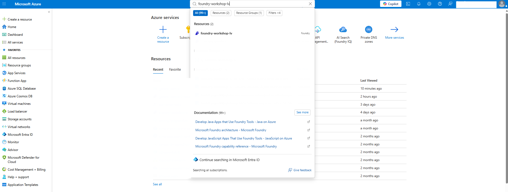
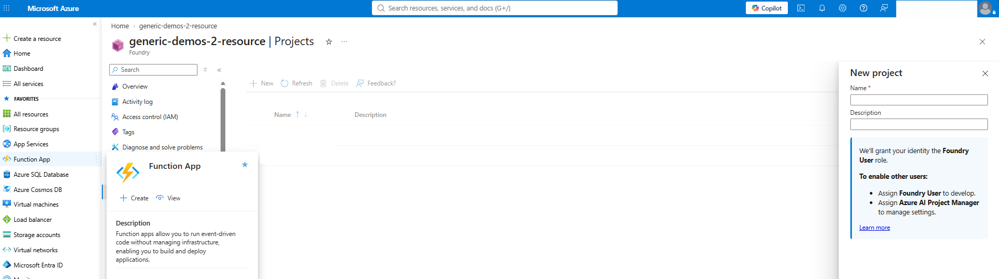

# Lab 1: Create Your Foundry Project

[← Back to Workshop Overview](./README.md) | [Next: Lab 2 →](./lab-2-create-knowledge-base.md)

---

**⏱️ Estimated Time**: 5-10 minutes

## Overview

The workshop administrator has already provisioned the shared **Microsoft Foundry resource**, the required **model deployments**, and **Azure AI Search**. In this lab, you'll create your own project under that shared Foundry resource.

Your project gives you an isolated workspace for your knowledge connection, knowledge base, agent, tools, and traces while still allowing you to use the resources prepared by the administrator.

---

## Instructions

### Step 1. Create you project

1. Go to [Azure Portal](https://portal.azure.com) and log in
2. Search for the Foundry resource name provided by your workshop facilitator on the top search bar

   

1. In the Foundry resource menu, under **Resource management** on the left bar, select **Projects**
2. Click **New**

   

3. Enter a unique project name e.g.: `company-assistant-[yourname]`
4. Click **Create** and wait for the project deployment to finish
5. Open the new project, then click **Go to Foundry portal**
6. Toggle the **New Foundry** experience if prompted

   

### Step 2. Verify the Shared Model Deployments

1. In the Foundry portal, go to Build on the top right
2. Go to models on the left to see your model deployments
3. Confirm that you can see the administrator-provisioned chat model and embedding model

### ✅ Checkpoint

You should now have:
- [ ] Access to the administrator-provisioned Foundry resource
- [ ] Your own project: `company-assistant-[yourname]`
- [ ] Access to the administrator-provisioned chat and embedding model deployments

---

[← Back to Workshop Overview](./README.md) | [Next: Lab 2 →](./lab-2-create-knowledge-base.md)
