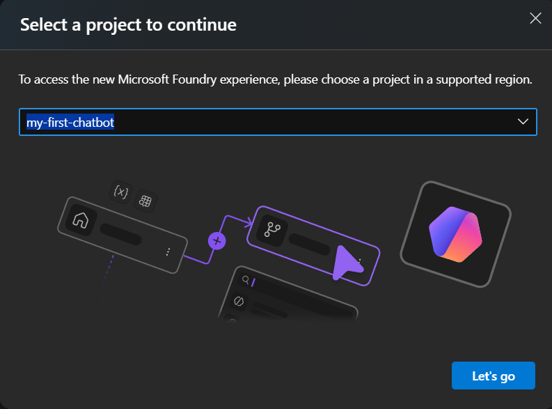

# Lab 1: Set Up Azure Resources

[← Back to Workshop Overview](./README.md) | [Next: Lab 2 →](./lab-2-prepare-data-sources.md)

---

**⏱️ Estimated Time**: 15-20 minutes

## Overview

In this lab, you'll set up Microsoft Foundry and deploy the AI models that power your agent:
- **Chat/Reasoning Model** – generates responses to user questions
- **Embedding Model** – converts text into vectors for semantic search

---

## 🎯 Model Options

The models below were chosen for this workshop based on availability and quota limits at the time of writing. For your own projects, you can use newer models depending on your needs and regional availability.

### Chat/Reasoning Models

| Model | Description | Best For |
|-------|-------------|----------|
| `gpt-4.1-mini` | Fast, cost-effective GPT-4.1 variant | General use (recommended) |
| `gpt-4.1` | Latest GPT-4 with improved reasoning | Complex reasoning tasks |
| `gpt-4o` | Multimodal model with vision support | Multimodal applications |

### Embedding Models

| Model | Dimensions | Best For |
|-------|------------|----------|
| `text-embedding-3-small` | 1536 | General use (recommended) |
| `text-embedding-3-large` | 3072 | Higher accuracy, larger index |
| `text-embedding-ada-002` | 1536 | Legacy compatibility |

> 💡 **Note**: This workshop uses `gpt-4.1-mini` and `text-embedding-3-small` by default. If you choose different models, update the model names in all subsequent steps.

---

## 🎓 Key Concepts

### What is Microsoft Foundry?

Microsoft Foundry is a unified AI platform that provides:
- **Project Management**: Organize your AI resources and deployments
- **Model Catalog**: Access to GPT, embedding, and other AI models
- **Development Tools**: Build, test, and deploy AI applications
- **Monitoring**: Track usage, costs, and performance

### What are Model Deployments?

A deployment is an instance of a model that you can call via API:
- **Chat/Reasoning Models** (e.g., `gpt-4.1-mini`): For generating natural language responses
- **Embedding Models** (e.g., `text-embedding-3-small`): For converting text to vectors

---

## Resources You'll Create

- **Resource Group**: Container for all your Azure resources
- **Microsoft Foundry**: AI platform hub and project
- **Model Deployments**: Chat model and embedding model

---

## Instructions

> ✏️ **Replace [yourname]** with your actual name or identifier (e.g., `jsmith`) throughout these instructions. This ensures your resources are uniquely named.

### 1. Create a Resource Group

1. Go to [Azure Portal](https://portal.azure.com)
2. Click "Resource groups" → "Create"

   
   

3. Configure:
   - **Name**: `rg-foundry-workshop-[yourname]`
   - **Region**: East US 2
4. Click "Review + Create" → "Create"

   

### 2. Create Microsoft Foundry Resource

1. Search for "Microsoft Foundry" in the Azure Portal
2. Click "Create"

   

3. Configure:
   - **Resource group**: `rg-foundry-workshop-[yourname]`
   - **Name**: `foundry-workshop-[yourname]`
   - **Region**: East US 2
   - **Default project name**: `my-first-chatbot`
4. Click "Review + Create" → "Create"

   

### 3. Deploy AI Models

1. Go to your Foundry resource → Click "Go to Foundry portal"
2. Toggle "New Foundry" experience if prompted

   

3. Select your project (`my-first-chatbot`) → "Let's go"

   

4. **Deploy Chat Model** (default: `gpt-4.1-mini`):
   - Go to Discovery → Models
   - Search for `gpt-4.1-mini` (or your chosen model from the Model Options section)
   - Click the model → Deploy → "Default settings"

   
   

5. **Deploy Embedding Model** (default: `text-embedding-3-small`):
   - Repeat for `text-embedding-3-small` (or `text-embedding-ada-002`)
   - Discovery → Models → Search → Deploy → "Default settings"

### ✅ Checkpoint

You should now have:
- [ ] Resource group: `rg-foundry-workshop-[yourname]`
- [ ] Foundry resource with project: `my-first-chatbot`
- [ ] Deployed models: chat model (e.g., `gpt-4.1-mini`) and embedding model (e.g., `text-embedding-3-small`)

---

[← Back to Workshop Overview](./README.md) | [Next: Lab 2 →](./lab-2-prepare-data-sources.md)
