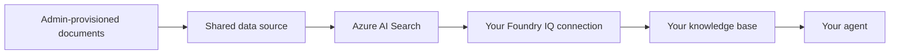

# Lab 2: Create a Knowledge Base

[← Back to Workshop Overview](./README.md) | [← Previous: Lab 1](./lab-1-setup-azure-resources.md) | [Next: Lab 3 →](./lab-3-create-agent.md)

---

**⏱️ Estimated Time**: 10-15 minutes

## Overview

In this lab, you'll create a **knowledge base** using **Foundry IQ**, the managed knowledge layer in Microsoft Foundry. The workshop administrator has already provisioned Azure AI Search and made the NovaPharma documents available through its underlying data source.

You will connect the existing Foundry IQ resource to your project, select the prepared data, and create your own knowledge base. This project-level connection is not automatically available in other participants' projects.

---

## 🎓 Key Concepts

### What is Foundry IQ?

Foundry IQ connects enterprise data to AI agents:

- **Automatic vectorization**: Documents are chunked, embedded, and indexed
- **Agentic retrieval**: Complex questions can be decomposed into focused subqueries
- **Grounded answers with citations**: Responses can include references to source content

### Shared Infrastructure, Isolated Configuration

The administrator manages the shared Azure AI Search service, model deployments, and source documents. You manage the configuration inside your own Foundry project:

- Your Foundry IQ connection
- Your knowledge base and retrieval instructions
- Your agent's connection to that knowledge base

The backing documents may be stored in Azure Blob Storage or another supported source. You do not need to upload or manage them in this workshop.

### How It Works



---

## Step 1: Navigate to Knowledge

1. In the [Microsoft Foundry portal](https://ai.azure.com), select your project: `company-assistant-[yourname]`
2. In the left navigation under **Build**, click **Knowledge**

You'll see the **Knowledge (Foundry IQ)** page with the available knowledge bases and indexes.


---

## Step 2: Connect the Existing Foundry IQ Resource

The first time you open Knowledge in your project, Foundry asks you to select a Foundry IQ resource.

1. Click **Connect resource** or **Select resource**, depending on the option shown
2. Choose the existing Foundry IQ or Azure AI Search resource identified by your workshop facilitator
3. Do not choose **Create new resource**
4. Confirm the connection and wait while Foundry validates access

If Foundry shows a secure-access setup dialog, wait for it to complete. The required resource access has been prepared by the workshop administrator.

> 💡 The connection you create belongs to your project. Other participants still need to connect the shared resource from their own projects.

---

## Step 3: Create the Knowledge Base

1. Click **Create a knowledge base**


2. Fill in the basic configuration:
   - **Name**: `company-knowledge-base`
   - **Description**: `NovaPharma product portfolio and regulatory guidelines`
   - **Chat completions model**: Select the administrator-provisioned chat model, for example `gpt-5.6-sol`
   - **Retrieval reasoning effort**: Leave as `Minimal`
   - **Output mode**: Leave as `Extractive data`
   - **Retrieval instructions**:

     ```text
     This knowledge base contains pharmaceutical product information and regulatory guidelines for NovaPharma. When retrieving information, prioritize precise dosing, contraindications, and safety data. Distinguish clearly between the three products: NovaRelief (pain/NSAID), CardioShield (cardiovascular/ARB), and ImmunoBoost (immunology/biologic). For regulatory questions, include relevant timelines and submission requirements.
     ```

---

## Step 4: Connect the Prepared Knowledge Source

1. In **Knowledge sources (Foundry IQ)**, click **Add source**
2. Select the existing source or index identified by your workshop facilitator
3. Confirm that it points to the preloaded NovaPharma product portfolio and regulatory guidelines
4. If prompted for an embedding model, select the administrator-provisioned embedding deployment, for example `text-embedding-3-small`
5. Click **Connect** or **Add**
6. Wait until the source status is **Active**

Do not upload the files from the repository. They are included there for reference only; the workshop source has already been loaded by the administrator.

> ⚠️ If the prepared source or index is not listed, stop and ask the workshop facilitator to verify your access. Do not create another Search service or upload a duplicate copy of the documents.

---

## Step 5: Save and Verify the Knowledge Base

1. Click **Save knowledge base**
2. Open `company-knowledge-base`
3. Use the test experience, if available, to ask:

   ```text
   What are the approved indications for NovaRelief?
   ```

4. Confirm that the answer contains information from the prepared NovaPharma content and includes a source reference

---

## ✅ What You Accomplished

In this lab, you:

- ✅ Connected your project to the administrator-provisioned Foundry IQ and Azure AI Search resources
- ✅ Reused the prepared NovaPharma documents without uploading duplicates
- ✅ Created a project-scoped knowledge base with retrieval instructions
- ✅ Verified that the knowledge base can retrieve grounded content

Your knowledge base is ready to be connected to an agent in the next lab.

---

## 💡 Tips

- **Project isolation**: A connection made in your project does not automatically appear in another participant's project
- **Shared data**: Multiple projects can use the same administrator-managed Search service and source data
- **Production sources**: Azure Blob Storage, SharePoint, OneLake, and other supported systems can remain the system of record while Foundry IQ provides retrieval

---

[Next: Lab 3 - Create Your First Agent →](./lab-3-create-agent.md)
