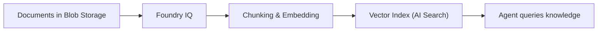
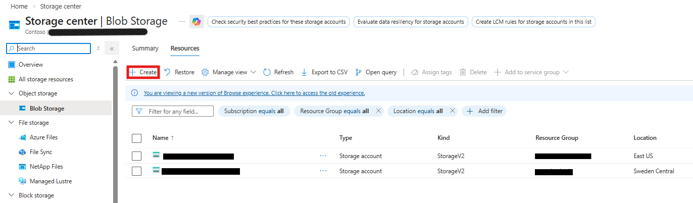
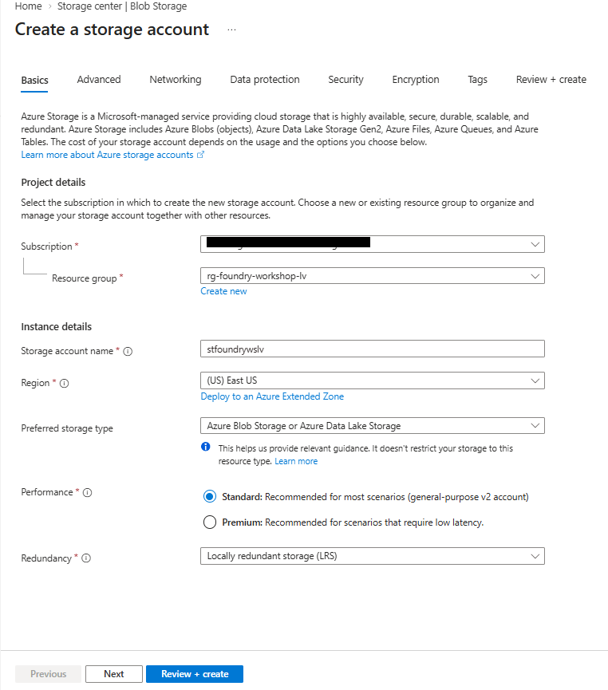
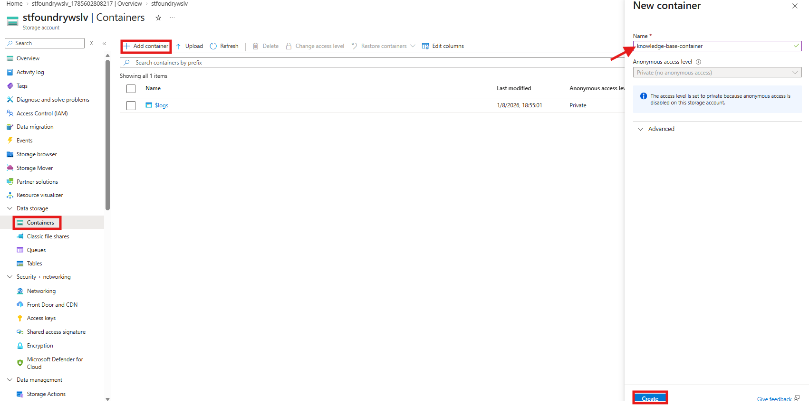
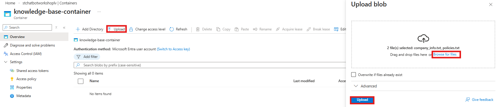

# Lab 2: Create a Knowledge Base

[← Back to Workshop Overview](./README.md) | [← Previous: Lab 1](./lab-1-setup-azure-resources.md) | [Next: Lab 3 →](./lab-3-create-agent.md)

---

**⏱️ Estimated Time**: 20-25 minutes

## Overview

In this lab, you'll create a **knowledge base** for your chatbot. You'll first upload your documents to **Azure Blob Storage**, then use **Foundry IQ** to connect to that storage and automatically index your documents for AI-powered retrieval.

This approach mirrors real-world patterns where documents already live in cloud storage and need to be connected to an AI system.

---

## 🎓 Key Concepts

### What is Azure Blob Storage?

Azure Blob Storage is Microsoft's object storage solution for the cloud:

- **Blobs**: Binary Large Objects (any type of file)
- **Containers**: Logical groupings of blobs (like folders)
- **Storage Account**: Top-level namespace for your data

### What is Foundry IQ?

Foundry IQ is the managed knowledge layer in Microsoft Foundry that connects your enterprise data to AI agents:

- **Automatic vectorization**: Your documents are automatically chunked, embedded, and indexed
- **Agentic retrieval**: Complex questions are automatically decomposed into subqueries
- **Grounded answers with citations**: Returns extractive data with source references

### Supported Data Sources

Foundry IQ can connect to multiple types of data sources:

| Source | Description |
|--------|-------------|
| **Azure Blob Storage** | Files stored in cloud storage containers (used in this lab) |
| **SharePoint** | Documents from SharePoint sites and document libraries |
| **OneLake** | Data from Microsoft Fabric lakehouses |
| **Web URLs** | Content from public web pages |
| **Direct file upload** | Upload files directly without a separate storage account |

In this lab, we use **Azure Blob Storage** because it's the most common pattern in production: your documents live in cloud storage, and Foundry IQ connects to them. In your own projects, you could just as easily point to a SharePoint document library where your team already stores files.

### How It Works

---

## Step 1: Create a Storage Account

1. Go to the [Azure Portal](https://portal.azure.com)
2. Search for **"Storage accounts"** in the top search bar and click **Create**

3. Configure:
   - **Resource group**: `rg-foundry-workshop-[yourname]`
   - **Storage account name**: `stchatbot[yourname]` (must be globally unique, lowercase, no special characters)
   - **Region**: East US
   - **Performance**: Standard
   - **Redundancy**: Locally-redundant storage (LRS)

4. Click **Review + Create** → **Create**

> 💡 Storage account names must be between 3 and 24 characters, using only lowercase letters and numbers.

---

## Step 2: Create a Blob Container

1. Once the storage account is deployed, click **Go to resource**
2. In the left menu under **Data storage**, click **Containers**
3. Click **+ Container**
4. Configure:
   - **Name**: `knowledge-base-container`
   - **Anonymous access level**: Private
5. Click **Create**

---

## Step 3: Upload Your Documents

1. Click on your `knowledge-base-container` to open it

> ⚠️ **Permissions Error?** If you see the error below, you need to grant yourself data plane permissions:
>
> 
>
> 1. Go to **Access Control (IAM)** on your storage account
> 2. Click **Add** → **Add role assignment**
> 3. Choose role: **Storage Blob Data Contributor**
> 4. Click **Next** → Select **User, group, or service principal** → Click **Select members** → Select yourself
> 5. Click **Review + assign** (twice)
> 6. Wait 1-2 minutes, then refresh the page

2. Click **Upload**
3. Select both files from the `data/knowledge_base/` folder in this repository:
   - `company_info.txt`
   - `policies.txt`
4. Click **Upload**

You should see both files listed in your container.

---

## Step 4: Navigate to Knowledge (Foundry IQ)

1. Go back to the [Microsoft Foundry portal](https://ai.azure.com) and make sure you're in your project (`company-assistant`)
2. In the left navigation under **Build**, click **Knowledge**

You'll see the **Knowledge (Foundry IQ)** page with two tabs: Knowledge bases and Indexes.

---

## Step 5: Connect an AI Search Resource

The first time you use Knowledge, you'll need to connect an AI Search resource:

1. Click **Create new resource**
2. In the dialog that appears:
   - **Resource name**: Leave the auto-generated name (e.g., `company-assistant-srch-xxxxx`)
   - **Subscription**: Select your subscription
   - **Resource group**: `rg-foundry-workshop-[yourname]`
   - **Region**: Choose a region that has capacity (if you see a "region at capacity" warning, try another region like **West US 2** or **North Central US**)
3. Check the **acknowledgment checkbox** about additional costs
4. Click **Create**

A "Setting up secure access" dialog will appear, showing that Foundry is granting the necessary RBAC roles (Search Service Contributor). Wait for it to complete.

> 💡 This creates an Azure AI Search resource and configures the managed identity permissions automatically.

---

## Step 6: Create a Knowledge Base

1. Click **Create a knowledge base**

2. Fill in the basic configuration:
   - **Name**: `company-knowledge-base`
   - **Description**: `Company information and policies for the chatbot agent`
   - **Chat completions model**: Select `gpt-5.5` (from your deployments)
   - **Retrieval reasoning effort**: Leave as `Minimal`
   - **Output mode**: Leave as `Extractive data`

---

## Step 7: Add a Knowledge Source from Blob Storage

1. In the **Knowledge sources (Foundry IQ)** section, click **Add sources**
2. A "Create a knowledge source" dialog appears:
   - **Source type**: Select **Azure Blob Storage**
   - **Name**: `company-docs`
   - **Embedding model**: `text-embedding-3-small` should be auto-selected
   - **Storage account**: Select `stchatbot[yourname]`
   - **Container**: Select `knowledge-base-container`
3. Click **Create**

> ⚠️ **If connection fails**: The AI Search service needs the **Storage Blob Data Reader** role on your storage account. Foundry IQ usually assigns this automatically, but if it fails:
>
> 1. Go to **Azure Portal** → Your Storage Account → **Access Control (IAM)**
> 2. Click **Add** → **Add role assignment**
> 3. Select role: **Storage Blob Data Reader**
> 4. Assign to **Managed identity** → Select your **AI Search** service
> 5. Click **Review + assign**
> 6. Wait 2-3 minutes, then retry
>
> 

---

## Step 8: Save the Knowledge Base

1. Once you see the knowledge source with **"Active"** status and **"2 files"** listed, click **Save knowledge base** at the top right

You're now on the knowledge base detail page showing your configured `company-knowledge-base`.

---

## ✅ What You Accomplished

In this lab, you:

- ✅ Created a Storage Account with a blob container
- ✅ Uploaded your documents to Azure Blob Storage
- ✅ Connected a Foundry IQ resource (Azure AI Search) with automated RBAC
- ✅ Created a knowledge base connected to your blob storage
- ✅ Files are automatically chunked, embedded with `text-embedding-3-small`, and indexed

Your knowledge base is now ready to be connected to an agent in the next lab.

---

## 💡 Tips

- **Adding more documents later**: Upload new files to your blob container, then click "Sync" on the knowledge source in Foundry IQ to re-index.
- **Multiple knowledge sources**: A single knowledge base can have multiple sources (blob storage, SharePoint, web URLs). You can click "Add sources" to connect additional data.
- **Why Blob Storage?**: In production, documents often already live in cloud storage. This pattern lets you manage your files independently and connect them to multiple AI systems.

---

## 🔧 Troubleshooting

### 403 Forbidden when connecting knowledge base to agent

If you get a "403 Forbidden" error in Lab 3 when testing the agent with the knowledge base, the **project's managed identity** needs RBAC roles on the AI Search service:

1. Go to the **Azure Portal** → Your AI Search resource
2. Click **Access control (IAM)** → **Add role assignment**
3. Assign **Search Index Data Reader** to your Foundry project's managed identity
4. Wait 1-2 minutes for propagation, then retry

> 💡 The project identity is different from the Foundry resource identity. You can find it under your project resource in the Azure Portal → Identity.

---

[Next: Lab 3 - Create Your First Agent →](./lab-3-create-agent.md)
