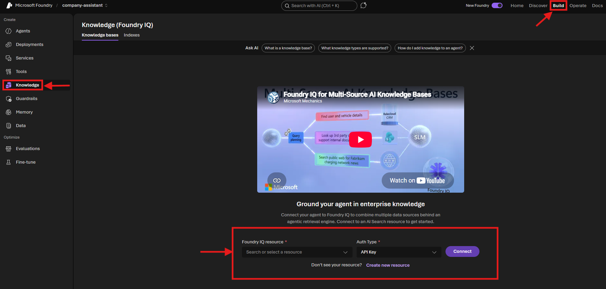
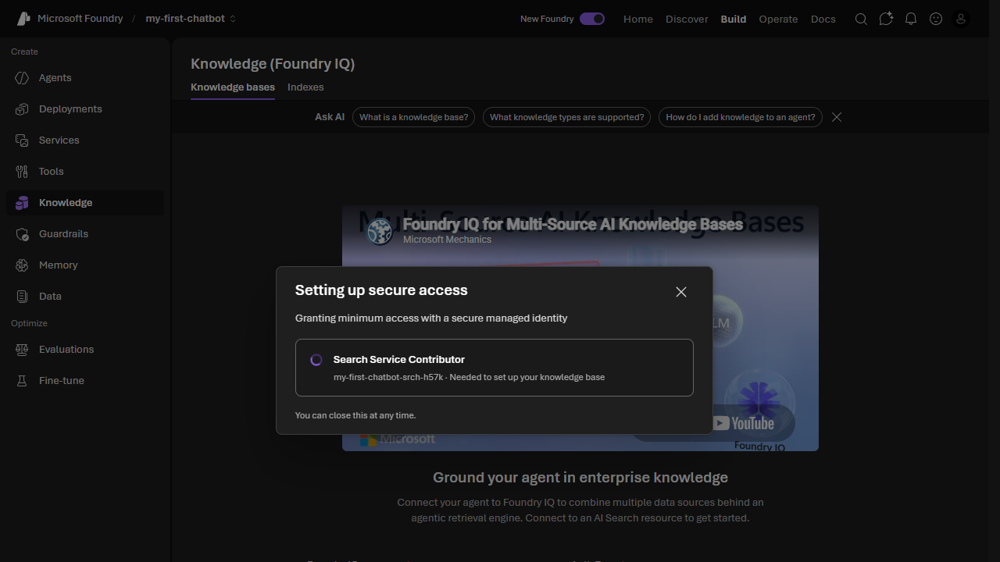
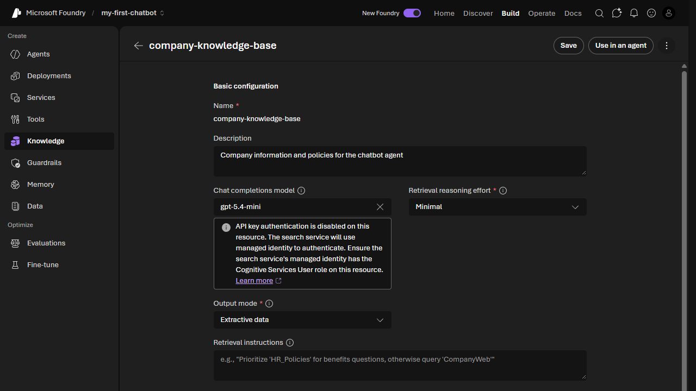
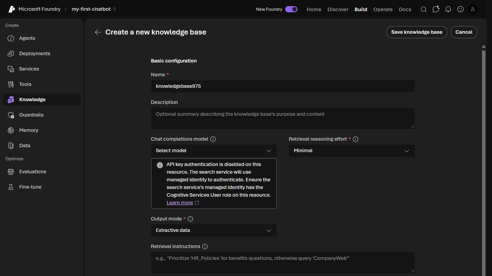
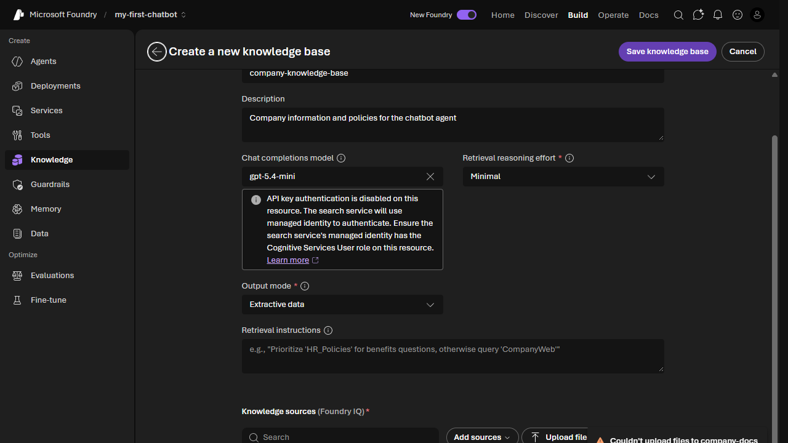
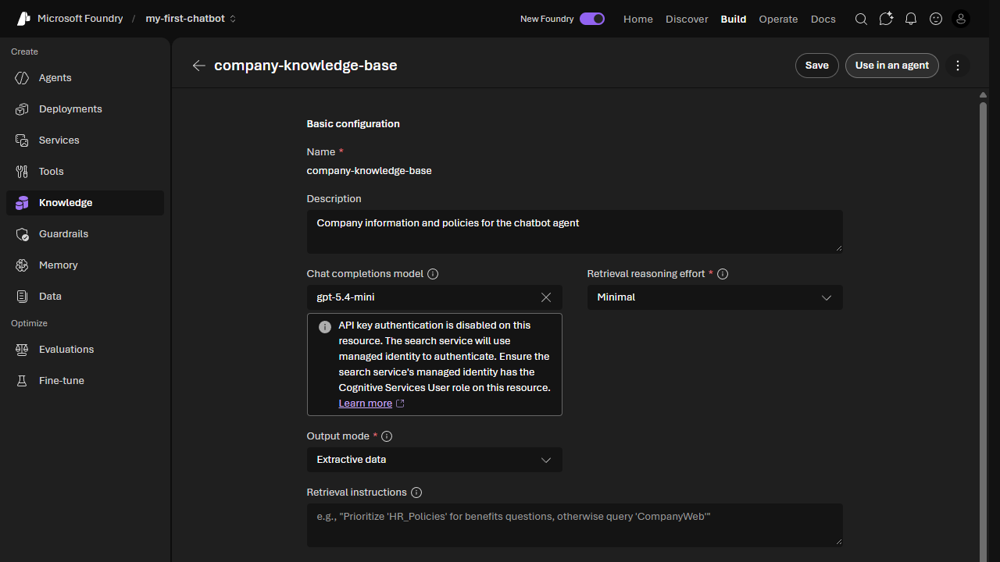

# Lab 2: Create a Knowledge Base

[← Back to Workshop Overview](./README.md) | [← Previous: Lab 1](./lab-1-setup-azure-resources.md) | [Next: Lab 3 →](./lab-3-create-agent.md)

---

**⏱️ Estimated Time**: 15-20 minutes

## Overview

In this lab, you'll create a **knowledge base** using **Foundry IQ**, the managed knowledge layer in Microsoft Foundry. You'll upload documents directly through the portal and Foundry IQ will handle storage, indexing, and vectorization automatically.

---

## 🎓 Key Concepts

### What is Foundry IQ?

Foundry IQ is the managed knowledge layer in Microsoft Foundry that connects your enterprise data to AI agents:

- **Automatic vectorization**: Your documents are automatically chunked, embedded, and indexed
- **Agentic retrieval**: Complex questions are automatically decomposed into subqueries
- **Grounded answers with citations**: Returns extractive data with source references

### Supported Data Sources

Foundry IQ can connect to multiple types of data sources:

| Source | Description |
|--------|-------------|
| **Direct file upload** | Upload files directly through the portal (used in this lab) |
| **Azure Blob Storage** | Files stored in cloud storage containers |
| **SharePoint** | Documents from SharePoint sites and document libraries |
| **OneLake** | Data from Microsoft Fabric lakehouses |
| **Web URLs** | Content from public web pages |

In this lab, we use **direct file upload** for simplicity. In production, you would typically connect to an existing data source like Azure Blob Storage or SharePoint where your documents already live.

### How It Works

---

## Step 1: Navigate to Knowledge (Foundry IQ)

1. In the [Microsoft Foundry portal](https://ai.azure.com), make sure you're in your project (`company-assistant`)
2. In the left navigation under **Build**, click **Knowledge**

You'll see the **Knowledge (Foundry IQ)** page with two tabs: Knowledge bases and Indexes.

---

## Step 2: Connect an AI Search Resource

The first time you use Knowledge, you'll need to connect an AI Search resource:

1. Click **Create new resource**
2. In the dialog that appears:
   - **Resource name**: Leave the auto-generated name (e.g., `company-assistant-srch-xxxxx`)
   - **Subscription**: Select your subscription
   - **Resource group**: `rg-foundry-workshop-[yourname]`
   - **Region**: Choose a region that has capacity (if you see a "region at capacity" warning, try another region like **West US 2** or **North Central US**)
3. Check the **acknowledgment checkbox** about additional costs
4. Click **Create**

A "Setting up secure access" dialog will appear, showing that Foundry is granting the necessary RBAC roles (Search Service Contributor). Wait for it to complete.

> 💡 This creates an Azure AI Search resource and configures the managed identity permissions automatically.

---

## Step 3: Create a Knowledge Base

1. Click **Create a knowledge base**

2. Fill in the basic configuration:
   - **Name**: `company-knowledge-base`
   - **Description**: `Company information and policies for the chatbot agent`
   - **Chat completions model**: Select `gpt-5.5` (from your deployments)
   - **Retrieval reasoning effort**: Leave as `Minimal`
   - **Output mode**: Leave as `Extractive data`

---

## Step 4: Upload Files as a Knowledge Source

1. In the **Knowledge sources (Foundry IQ)** section, click **Upload files**
2. A "Create a knowledge source" dialog appears:
   - **Source type**: File (Preview)
   - **Name**: `company-docs`
   - **Embedding model**: `text-embedding-3-small` should be auto-selected
3. In the **Drop files here or browse** area, upload both files from the `data/knowledge_base/` folder in this repository:
   - `company_info.txt`
   - `policies.txt`
4. Click **Create**

> ⚠️ **If upload fails**: Wait 2-3 minutes for the managed identity permissions to propagate, then click **Retry**. The search service needs time for its role assignments to take effect.

---

## Step 5: Save the Knowledge Base

1. Once you see the knowledge source with **"Active"** status and **"2 files"** listed, click **Save knowledge base** at the top right

You're now on the knowledge base detail page showing your configured `company-knowledge-base`.

---

## ✅ What You Accomplished

In this lab, you:

- ✅ Connected a Foundry IQ resource (Azure AI Search) with automated RBAC
- ✅ Created a knowledge base with `gpt-5.5` for reasoning
- ✅ Uploaded documents directly through the portal
- ✅ Files are automatically chunked, embedded with `text-embedding-3-small`, and indexed

Your knowledge base is now ready to be connected to an agent in the next lab.

---

## 💡 Tips

- **Adding more documents later**: You can always come back and click "Upload files" to add more documents to the knowledge source.
- **Multiple knowledge sources**: A single knowledge base can have multiple sources. You can click "Add sources" to connect additional data from blob storage, SharePoint, or web URLs.
- **Production data sources**: In a real scenario, you would typically connect to Azure Blob Storage or SharePoint where your team already stores documents, rather than uploading files directly.

---

## 🔧 Troubleshooting

### 403 Forbidden when connecting knowledge base to agent

If you get a "403 Forbidden" error in Lab 3 when testing the agent with the knowledge base, the **project's managed identity** needs RBAC roles on the AI Search service:

1. Go to the **Azure Portal** → Your AI Search resource
2. Click **Access control (IAM)** → **Add role assignment**
3. Assign **Search Index Data Reader** to your Foundry project's managed identity
4. Wait 1-2 minutes for propagation, then retry

> 💡 The project identity is different from the Foundry resource identity. You can find it under your project resource in the Azure Portal → Identity.

---

[Next: Lab 3 - Create Your First Agent →](./lab-3-create-agent.md)
