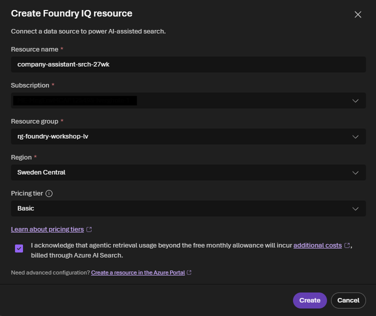
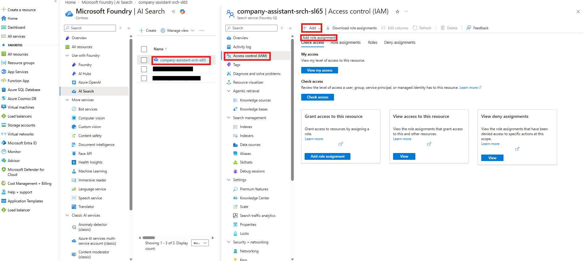
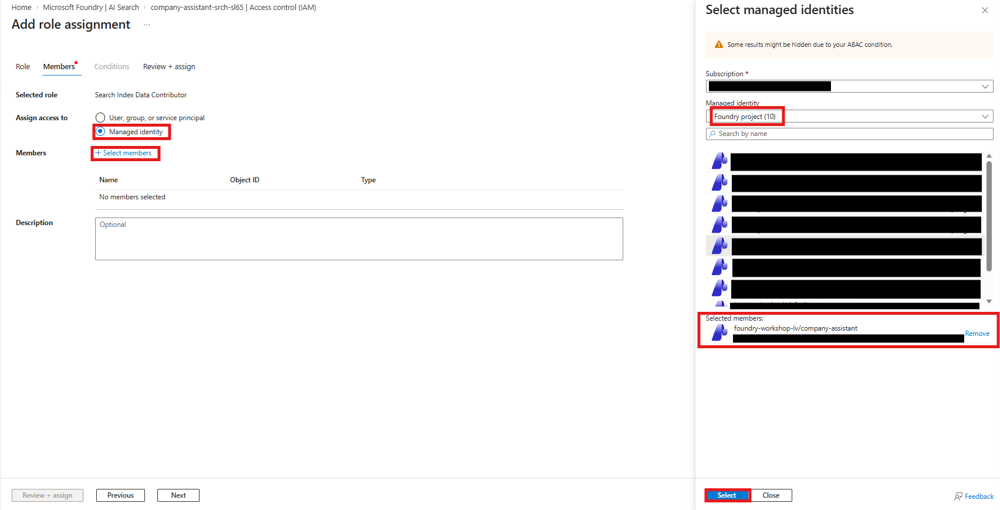
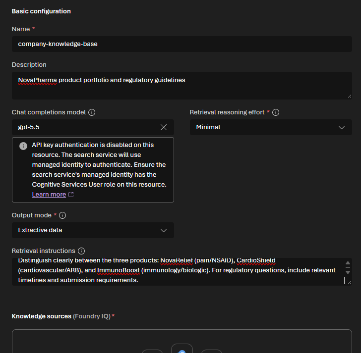
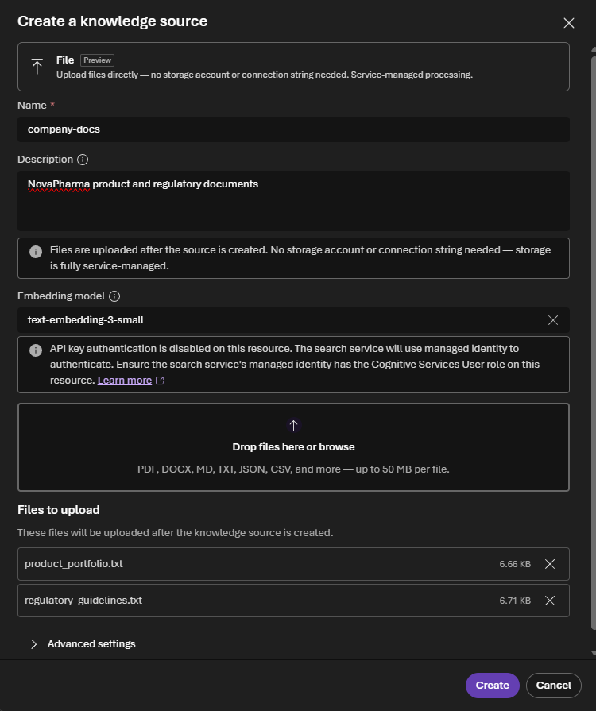

# Lab 2: Create a Knowledge Base

[← Back to Workshop Overview](./README.md) | [← Previous: Lab 1](./lab-1-setup-azure-resources.md) | [Next: Lab 3 →](./lab-3-create-agent.md)

---

**⏱️ Estimated Time**: 15-20 minutes

## Overview

In this lab, you'll create a **knowledge base** using **Foundry IQ**, the managed knowledge layer in Microsoft Foundry. You'll upload NovaPharma's product portfolio and regulatory guidelines, and Foundry IQ will handle storage, indexing, and vectorization automatically.

---

## 🎓 Key Concepts

### What is Foundry IQ?

Foundry IQ is the managed knowledge layer in Microsoft Foundry that connects your enterprise data to AI agents:

- **Automatic vectorization**: Your documents are automatically chunked, embedded, and indexed
- **Agentic retrieval**: Complex questions are automatically decomposed into subqueries
- **Grounded answers with citations**: Returns extractive data with source references

### Supported Data Sources

Foundry IQ can connect to multiple types of data sources:

| Source | Description |
|--------|-------------|
| **Direct file upload** | Upload files directly through the portal (used in this lab) |
| **Azure Blob Storage** | Files stored in cloud storage containers |
| **SharePoint** | Documents from SharePoint sites and document libraries |
| **OneLake** | Data from Microsoft Fabric lakehouses |
| **Web URLs** | Content from public web pages |

In this lab, we use **direct file upload** for simplicity. In production, you would typically connect to an existing data source like Azure Blob Storage or SharePoint where your documents already live.

### How It Works


---

## Step 1: Navigate to Knowledge (Foundry IQ)

1. In the [Microsoft Foundry portal](https://ai.azure.com), make sure you're in your project (`company-assistant`)
2. In the left navigation under **Build**, click **Knowledge**

You'll see the **Knowledge (Foundry IQ)** page with two tabs: Knowledge bases and Indexes.


---

## Step 2: Connect an AI Search Resource

The first time you use Knowledge, you'll need to connect an AI Search resource:

1. Click **Create new resource**
2. In the dialog that appears:
   - **Resource name**: Leave the auto-generated name
   - **Subscription**: Select your subscription
   - **Resource group**: `rg-foundry-workshop-[yourname]`
   - **Region**: Sweden Central (same region as your Foundry resource)
   - **Pricing tier**: Basic
3. Check the **acknowledgment checkbox** about additional costs
4. Click **Create**



A "Setting up secure access" dialog will appear, showing that Foundry is granting the necessary RBAC roles (Search Service Contributor). Wait for it to complete.


> 💡 This creates an Azure AI Search resource and configures some managed identity permissions automatically. However, the agent also needs **Search Index Data Reader** to query the knowledge base. We'll add that now.

5. Once the search resource is created, go to the **Azure Portal** (portal.azure.com)
6. Navigate to your **AI Search** resource (search for the name shown in the Foundry portal, e.g. `company-assistant-srch-xxxx`)
7. Click **Access control (IAM)** in the left menu
8. Click **+ Add** > **Add role assignment**



9. Search for and select **Search Index Data Reader**, then click **Next**
10. Select **Managed identity**, then click **+ Select members**
11. In the **Managed identity** dropdown, select **Foundry project**
12. In the search box, type `company-assistant` to find your Foundry project
13. Select your Foundry project from the list, then click **Select**
14. Click **Review + assign**





This ensures your agent can read the knowledge base index when you connect it in Lab 3.

---

## Step 3: Create a Knowledge Base

1. Click **Create a knowledge base**


2. Fill in the basic configuration:
   - **Name**: `company-knowledge-base`
   - **Description**: `NovaPharma product portfolio and regulatory guidelines`
   - **Chat completions model**: Select `gpt-5.5` (from your deployments)
   - **Retrieval reasoning effort**: Leave as `Minimal`
   - **Output mode**: Leave as `Extractive data`
   - **Retrieval instructions**:
     ```
     This knowledge base contains pharmaceutical product information and regulatory guidelines for NovaPharma. When retrieving information, prioritize precise dosing, contraindications, and safety data. Distinguish clearly between the three products: NovaRelief (pain/NSAID), CardioShield (cardiovascular/ARB), and ImmunoBoost (immunology/biologic). For regulatory questions, include relevant timelines and submission requirements.
     ```
3. In the **Knowledge sources (Foundry IQ)** section, click **Upload files**



---

## Step 4: Upload Files as a Knowledge Source

1. Download the 2 files from this repo in the folder `data/knowledge_base/`:
   - `product_portfolio.txt`
   - `regulatory_guidelines.txt`
2. In the **Knowledge sources (Foundry IQ)** section on the same page, click **Upload files**.
3. Select both `.txt` files from your downloads and open them.
4. A "Create a knowledge source" dialog appears:
   - **Name**: `novapharma-docs`
   - **Description**: `NovaPharma product portfolio and regulatory compliance guidelines`
   - **Embedding model**: `text-embedding-3-small` should be auto-selected
5. Under **Files to upload**, you should see both files listed with their sizes
6. Click **Create**

If you see an error "Couldn't upload files to novapharma-docs. 2 files failed to upload. Reason: File upload processing failed. Please check the file format and try again." when uploading files, you may have a policy blocking this.

1. Go to the **Azure Portal** > your Foundry resource (e.g. `foundry-workshop-[yourname]`) > **Properties**
2. Find **"Allow API key based authentication"** and set it to **Enabled**
3. If the setting keeps reverting to Disabled, an Azure Policy is overriding it. In that case:
   - Go to **Azure Portal** > search **Policy** > **Exemptions** > **+ Create policy exemption**
   - **Scope**: select your Foundry resource (under your resource group > Microsoft.CognitiveServices/accounts)
   - **Policy assignment**: select the assignment that enforces `CognitiveServicesDisableLocalAuth`
   - **Exemption category**: Waiver
   - Click **Review + Create**
   - Then go back to the Foundry resource **Properties** and set **"Allow API key based authentication"** to **Enabled** again (it will stick this time)
4. Go back to the Foundry portal and retry the file upload by clicking **Upload files**



> ⚠️ **If upload fails**: Wait 2-3 minutes for the managed identity permissions to propagate, then click **Retry**. The search service needs time for its role assignments to take effect.

---

## Step 5: Save the Knowledge Base

1. Once you see the knowledge source with **"Active"** status, click **Save knowledge base** at the top right

You're now on the knowledge base detail page showing your configured `company-knowledge-base`.


---

## ✅ What You Accomplished

In this lab, you:

- ✅ Connected a Foundry IQ resource (Azure AI Search) with automated RBAC
- ✅ Created a knowledge base with `gpt-5.5` for reasoning
- ✅ Uploaded product portfolio and regulatory guidelines through the portal
- ✅ Files are automatically chunked, embedded with `text-embedding-3-small`, and indexed

Your knowledge base is now ready to be connected to an agent in the next lab.

---

## 💡 Tips

- **Adding more documents later**: You can always come back and click "Upload files" to add more documents to the knowledge source.
- **Multiple knowledge sources**: A single knowledge base can have multiple sources. You can click "Add sources" to connect additional data from blob storage, SharePoint, or web URLs.
- **Production data sources**: In a real scenario, you would typically connect to Azure Blob Storage or SharePoint where your team already stores documents, rather than uploading files directly.


---

[Next: Lab 3 - Create Your First Agent →](./lab-3-create-agent.md)
