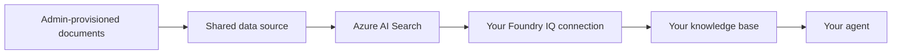
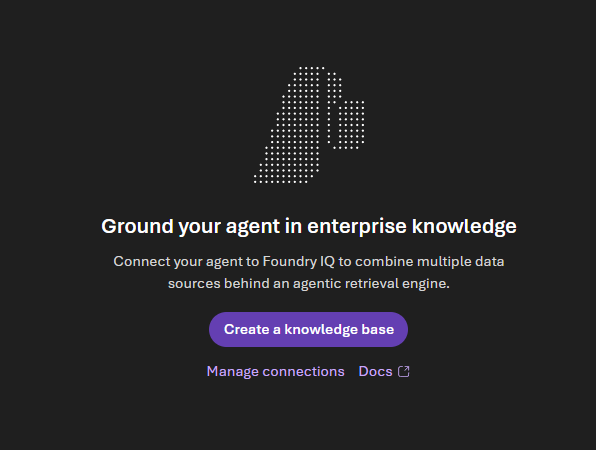

# Lab 2: Create a Knowledge Base

[← Back to Workshop Overview](./README.md) | [← Previous: Lab 1](./lab-1-setup-azure-resources.md) | [Next: Lab 3 →](./lab-3-create-agent.md)

---

**⏱️ Estimated Time**: 10-15 minutes

## Overview

In this lab, you'll create a **knowledge base** using **Foundry IQ**, the managed knowledge layer in Microsoft Foundry. The workshop administrator has already provisioned Azure AI Search and made the NovaPharma documents available through its underlying data source.

You will connect the existing Foundry IQ resource to your project, select the prepared data, and create your own knowledge base. 

### How It Works



---

## Step 1: Connect the Foundry IQ Resource

1. In the [Microsoft Foundry portal](https://ai.azure.com), select your project: `company-assistant-[yourname]`
2. In the left navigation under **Build**, click **Knowledge**
3. The first time you open Knowledge in your project, Foundry asks you to select a Foundry IQ resource. Choose the existing AI Search resource identified by your workshop facilitator and leave the Auth Type on API Key
4. Confirm the connection and wait while Foundry validates access

If Foundry shows a secure-access setup dialog, wait for it to complete. The required resource access has been prepared by the workshop administrator.

> 💡 The connection you create belongs to your project. 

---

## Step 2: Create the Knowledge Base

1. Click **Create a knowledge base**



2. Fill in the basic configuration:
   - **Name**: `company-knowledge-base`
   - **Description**: `NovaPharma product portfolio and regulatory guidelines`
   - **Chat completions model**: Select the administrator-provisioned chat model, for example `gpt-5.6-sol`
   - **Retrieval reasoning effort**: Leave as `Minimal`
   - **Output mode**: Leave as `Extractive data`
   - **Retrieval instructions**:

     ```text
     This knowledge base contains pharmaceutical product information and regulatory guidelines for NovaPharma. When retrieving information, prioritize precise dosing, contraindications, and safety data. Distinguish clearly between the three products: NovaRelief (pain/NSAID), CardioShield (cardiovascular/ARB), and ImmunoBoost (immunology/biologic). For regulatory questions, include relevant timelines and submission requirements.
     ```


3. In **Knowledge sources (Foundry IQ)**, click **Add source**
4. Select Azure AI Search Index 
5. In the **Create a knowledge source** window:
   - **Name**: `nova-pharma`
   - **Description**:
     ```text
     This index contains pharmaceutical product information and regulatory guidelines for NovaPharma. When retrieving information, prioritize precise dosing, contraindications, and safety data. Distinguish clearly between the three products: NovaRelief (pain/NSAID), CardioShield (cardiovascular/ARB), and ImmunoBoost (immunology/biologic). For regulatory questions, include relevant timelines and submission requirements.
     ```
   - **Select search index**: `Select the AI Search index given by your administrator

6. Click **create**
7. Click **Save knowledge base** on the top right.


---

## Step 5: Save and Verify the Knowledge Base

1. Click **Save knowledge base**
2. Open `company-knowledge-base`
3. Use the test experience, if available, to ask:

   ```text
   What are the approved indications for NovaRelief?
   ```

4. Confirm that the answer contains information from the prepared NovaPharma content and includes a source reference

---

## ✅ What You Accomplished

In this lab, you:

- ✅ Connected your project to Foundry IQ using the administrator-provisioned Azure AI Search resources
- ✅ Created a project-scoped knowledge base with retrieval instructions

Your knowledge base is ready to be connected to an agent in the next lab.

---

[Next: Lab 3 - Create Your First Agent →](./lab-3-create-agent.md)
