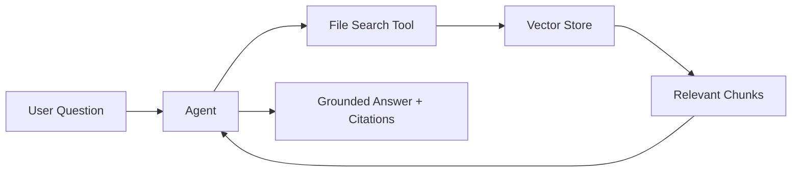

# Lab 2: Prepare Your Knowledge Base Documents

[← Back to Workshop Overview](./README.md) | [← Previous: Lab 1](./lab-1-setup-azure-resources.md) | [Next: Lab 3 →](./lab-3-create-agent.md)

---

**⏱️ Estimated Time**: 5-10 minutes

## Overview

In this lab, you'll review and understand the **knowledge base documents** that your agent will use to answer questions. These documents will be uploaded to the agent using the **File search** tool in Lab 3.

---

## 🎓 Key Concepts

### What is RAG (Retrieval-Augmented Generation)?

RAG is a technique that grounds AI responses in your own data:

Instead of relying only on the model's training data, the agent:
1. **Searches** your documents for relevant information
2. **Grounds** its answer in what it finds
3. **Cites** the source documents

### File Search Tool

The **File search** tool in Foundry:
- Creates a **vector store** from your uploaded files
- Automatically chunks, embeds, and indexes documents
- Supports semantic search to find relevant passages
- Returns results with source attribution

### Supported File Types

File search supports: **PDF, DOCX, MD, TXT, JSON, CSV**, and more.

---

## Step 1: Review the Sample Documents

Navigate to the `data/knowledge_base/` folder in this repository. You'll find two files:

### `company_info.txt`

Contains basic company information:
- Company name, founding year, headquarters
- What the company does
- Number of employees

### `policies.txt`

Contains various company policies:
- Return policy (30-day returns)
- Shipping options (Standard, Express, Overnight)
- Support hours and channels
- Privacy policy summary
- Terms of service highlights
- Subscription cancellation process
- Data security overview

---

## Step 2: Understand the Data Structure

These documents are intentionally simple for the workshop. In a real scenario, you might have:
- HR policy documents (PDF)
- Product documentation (Markdown)
- Internal wiki pages
- Knowledge base articles

> 💡 **Key insight**: The quality of your agent's answers directly depends on the quality and completeness of your documents. Well-structured, clear documents produce better grounded answers.

---

## Step 3: (Optional) Customize the Documents

Feel free to edit the documents in `data/knowledge_base/` to add your own content:
- Add more policies
- Change the company details
- Add FAQ-style content

Any changes you make will be reflected when you upload the files in Lab 3.

---

## ✅ What You Accomplished

In this lab, you:

- ✅ Reviewed the sample knowledge base documents
- ✅ Understood how RAG and File search work together
- ✅ Know what content the agent will use to answer questions

In the next lab, you'll create the agent and upload these documents using the File search tool.

---

[Next: Lab 3 - Create Your First Agent →](./lab-3-create-agent.md)
