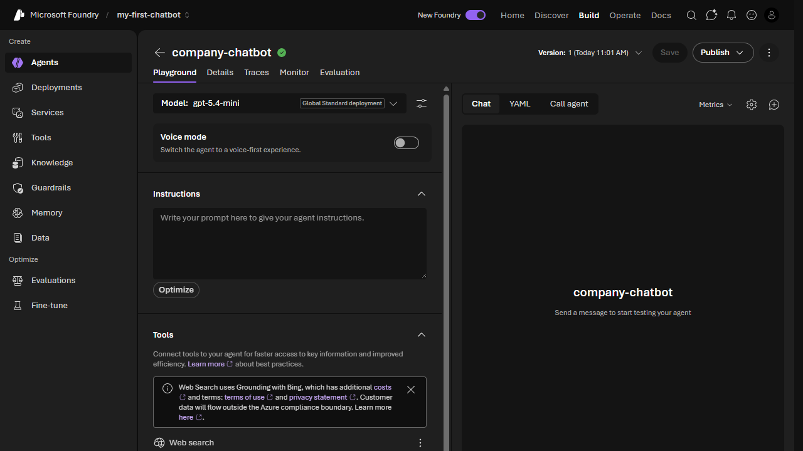

# Lab 3: Create Your First Agent

[← Back to Workshop Overview](./README.md) | [← Previous: Lab 2](./lab-2-create-knowledge-base.md) | [Next: Lab 4 →](./lab-4-word-document-tool.md)

---

**⏱️ Estimated Time**: 15-20 minutes

## Overview

In this lab, you'll create a **Foundry Agent** and connect it to your knowledge base. By the end, you'll have a working chatbot that can answer questions about your company using the documents you uploaded in Lab 2.

---

## 🎓 Key Concepts

### What is a Foundry Agent?

A Foundry Agent is an AI-powered assistant that can:
- Follow **instructions** you define (system prompt)
- Use **tools** to access external data and perform actions
- Query **knowledge bases** for grounded, citation-backed answers
- Maintain **conversation context** across multiple turns

### Agent Playground

The agent playground lets you:
- Configure your agent's model, instructions, tools, and knowledge
- Test conversations in real-time
- View traces and metrics
- Iterate on your agent's behavior before publishing

---

## Step 1: Navigate to Agents

1. In the **Microsoft Foundry** portal, click **Agents** in the left navigation under **Build**

---

## Step 2: Create a New Agent

1. Click the **New agent** button (top right)
2. From the dropdown menu, select **Build an agent**
3. In the dialog:
   - **Agent name**: `company-chatbot`
4. Click **Create and open playground**

You'll be taken to the **Playground** view of your new agent.



---

## Step 3: Configure the Agent Instructions

The instructions define how your agent behaves. In the **Instructions** textarea, enter:

```text
You are a helpful company assistant chatbot. You help employees find information about the company, its policies, and procedures.

When answering questions:
- Always ground your answers in the knowledge base documents provided
- Be concise and professional
- If you don't know the answer or can't find it in the documents, say so honestly
- Provide specific references to policies when applicable
```

---

## Step 4: Add File Search Tool

The **File search** tool lets your agent search through uploaded documents to ground its answers.

1. In the left panel, scroll to the **Tools** section
2. Click **Add** → Select **File search**
3. Click **Upload files**
4. Upload both files from the `data/knowledge_base/` folder:
   - `company_info.txt`
   - `policies.txt`
5. Wait for the files to be processed (status changes to ✓)

Your agent now has a vector store it can search to provide grounded answers.

> 💡 File search automatically creates a **vector store** that indexes your documents for semantic search. The agent will query this store whenever it needs to answer questions.

---

## Step 5: Save and Test

1. Click **Save** at the top right (the version number will increment)
2. In the **Chat** panel on the right, try these test questions:

**Test 1 — Company info:**
```
What is the name of the company and when was it founded?
```

**Test 2 — Policy question:**
```
What is the return policy?
```

**Test 3 — Shipping options:**
```
What shipping options are available?
```

The agent should answer using information from your knowledge base documents, with citations.

> 💡 If the agent responds with generic answers instead of grounded ones, check that the File search tool shows your vector store with files listed and that their status shows as processed.

---

## Step 6: Review the Response

Look for these indicators of proper grounding:
- **Citations**: The agent should reference specific documents
- **Accuracy**: Answers should match what's in `company_info.txt` and `policies.txt`
- **Honesty**: If you ask something not in the documents, the agent should say it doesn't know

---

## ✅ What You Accomplished

In this lab, you:

- ✅ Created a new Foundry Agent (`company-chatbot`)
- ✅ Defined agent instructions (system prompt)
- ✅ Connected the File search tool for RAG-grounded answers
- ✅ Tested the agent with questions about your company

Your basic chatbot agent is now working! In the next labs, you'll add more capabilities like document generation and email sending.

---

## 💡 Tips

- **Iterate on instructions**: If the agent's tone or behavior isn't right, update the instructions and test again
- **Voice mode**: Toggle "Voice mode" to test with speech input/output
- **Traces tab**: Click the "Traces" tab to see detailed execution logs of how the agent processes requests
- **Metrics tab**: See latency, token usage, and other performance data

---

[Next: Lab 4 - Create a Word Document Tool →](./lab-4-word-document-tool.md)
