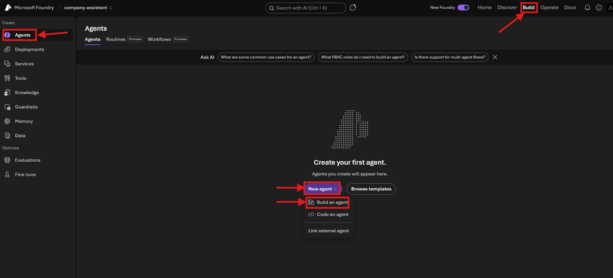
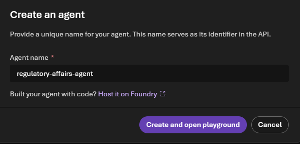
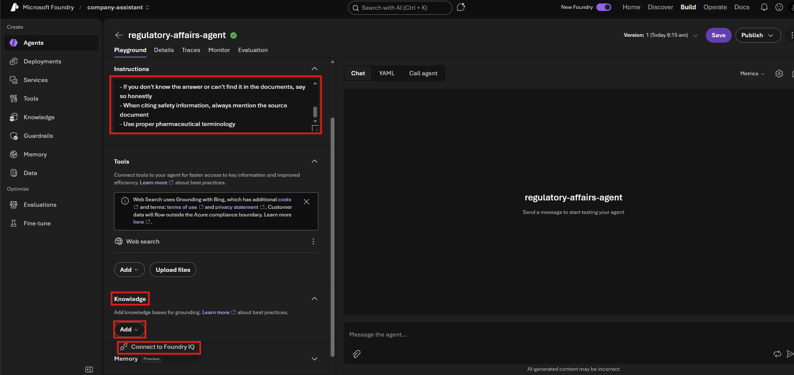
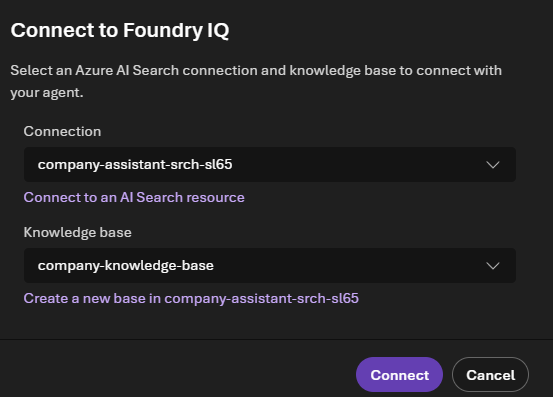
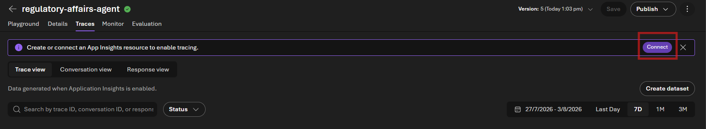
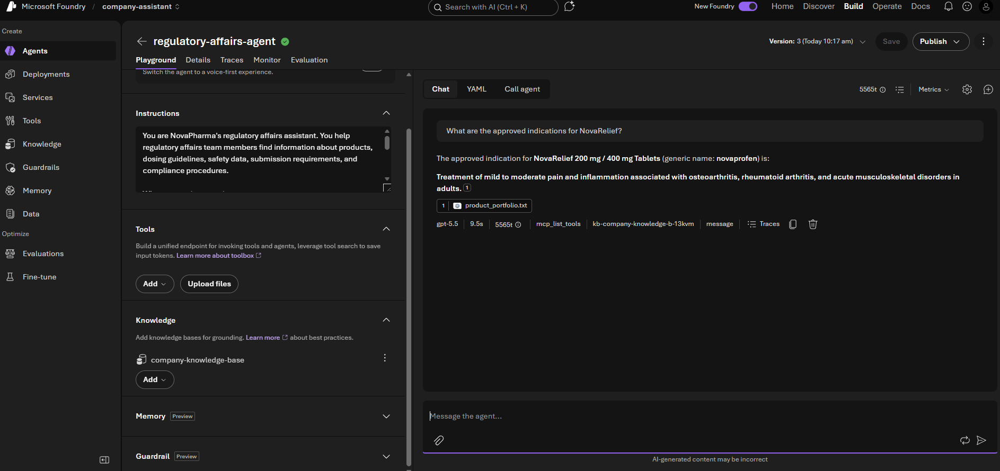

# Lab 3: Create Your First Agent

[← Back to Workshop Overview](./README.md) | [← Previous: Lab 2](./lab-2-create-knowledge-base.md) | [Next: Lab 4 →](./lab-4-word-document-tool.md)

---

**⏱️ Estimated Time**: 15-20 minutes

## Overview

In this lab, you'll create a **Foundry Agent** and connect it to your knowledge base. By the end, you'll have a working regulatory affairs assistant that can answer questions about NovaPharma's products and regulatory guidelines using the administrator-prepared documents you connected in Lab 2.

---

## Step 1: Create a New Agent

1. In the **Microsoft Foundry** portal, click **Build** on the top right. then click **Agents** in the left navigation.
2. Click **New agent**. 
3. From the dropdown menu, select **Build an agent**



4. In the dialog add  **Agent name**: `regulatory-affairs-agent`
5. Click **Create and open playground**



You'll be taken to the **Playground** view of your new agent.

---

## Step 2: Configure the Agent

1. Select the reasoning model that was deployed by your administrator.
2. The instructions define how your agent behaves. In the **Instructions** text area, enter:

```text
You are NovaPharma's regulatory affairs assistant. You help regulatory affairs team members find information about products, dosing guidelines, safety data, submission requirements, and compliance procedures.

When answering questions:
- Always ground your answers in the knowledge base documents provided
- Be precise with dosing, contraindications, and regulatory timelines
- If you don't know the answer or can't find it in the documents, say so honestly
- When citing safety information, always mention the source document
- Use proper pharmaceutical terminology
```

2. Connect the knowledge base by scrolling down in the left panel to the **Knowledge** section. Clicking the expand arrow to open it. And then clicking **Add** → **Connect to Foundry IQ**. 



4. For **Connection**, choose `company-assistant-src-xxxx`, for **Knowledge base**, pick `company-knowledge-base` from the list
5. Click **Connect**




Your agent now has access to the company documents for grounded answers.

6. Click **Save** at the top right (the version number will increment)

---

## Step 3: Enable Tracing

Before testing, connect Application Insights so you can view detailed traces of how your agent processes requests (you'll need this in later labs):

1. At the top of the agent view, click the **Traces** tab
2. Click **Connect** on the right side



3. On the App. Insights resource tab, select **Create new resource** in the dropdown to create a new Application Insights resource (or connect an existing one). 
4. Leave the default naming and click **Create**
5. Follow the wizard and click **Connect**

Once connected, traces are automatically captured for all agent interactions. You can return to this tab anytime to see detailed execution logs.

> 💡 Traces typically appear within 2-5 minutes of an interaction.

---

## Step 4: Test

1. Go back the the **Playground** tab. In the **Chat** panel on the right, try these test questions:

**Test 1: Product information**
```
What are the approved indications for NovaRelief?
```

The result should look as follows: 



**Test 2: Dosing question**
```
What is the recommended dose of CardioShield for heart failure patients?
```

**Test 3: Regulatory timeline**
```
When is the next PSUR due for ImmunoBoost?
```

The agent should answer using information from your knowledge base documents, with citations.

> 💡 If the agent responds with generic answers instead of grounded ones, check that the Knowledge section shows your knowledge base as connected and that the status is "Active".

---

## Step 5: Review the Response

Look for these indicators of proper grounding:
- **Citations**: The agent should reference specific documents
- **Accuracy**: Answers should match what's in `product_portfolio.txt` and `regulatory_guidelines.txt`
- **Honesty**: If you ask something not in the documents, the agent should say it doesn't know

---

## ✅ What You Accomplished

In this lab, you:

- ✅ Created a new Foundry Agent (`regulatory-affairs-agent`)
- ✅ Defined agent instructions (system prompt)
- ✅ Connected the knowledge base for RAG-grounded answers
- ✅ Enabled tracing with Application Insights
- ✅ Tested the agent with questions about your company

Your grounded agent is now working. In the next labs, you'll add document generation and inspect the complete execution through tracing.

---

## 💡 Tips

- **Iterate on instructions**: If the agent's tone or behavior isn't right, update the instructions and test again
- **Voice mode**: Toggle "Voice mode" to test with speech input/output
- **Traces tab**: Click the "Traces" tab to see detailed execution logs of how the agent processes requests
- **Metrics tab**: See latency, token usage, and other performance data

---

[Next: Lab 4 - Create a Word Document Tool →](./lab-4-word-document-tool.md)
