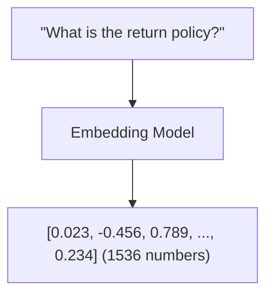
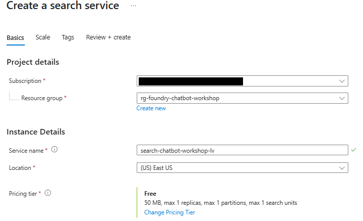
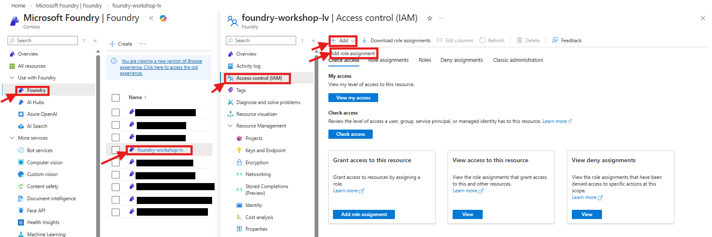

# Lab 3: Create Knowledge Base with Foundry IQ

[← Back to Workshop Overview](./README.md) | [← Previous: Lab 2](./lab-2-prepare-data-sources.md) | [Next: Lab 4 →](./lab-4-word-document-tool.md)

---

**⏱️ Estimated Time**: 20-30 minutes

## Overview

In this lab you'll create a knowledge base using Foundry IQ and Azure AI Search. The flow is:

1. **Create an AI Search service** and configure permissions
2. **Set up Foundry IQ** — connect your AI Search resource and create a knowledge base
3. **Import and index your data** from Blob Storage into the vector index

Foundry IQ is the managed knowledge layer that sits on top of your indexed data and provides intelligent, citation-grounded retrieval to your agents.

---

## 🎓 Key Concepts

### What is Foundry IQ?

Foundry IQ is a managed knowledge layer that connects your enterprise data to AI agents. It provides:
- **Multi-source knowledge bases**: Connect Azure Blob Storage, SharePoint, OneLake, and web data
- **Agentic retrieval**: Automatically decomposes complex questions into subqueries, executes them in parallel, and aggregates results
- **Permission-aware responses**: Enforces access control so agents only return content users are authorized to see
- **Grounded answers with citations**: Returns extractive data with sources so agents can trace answers back to documents

### What is a Vector Index?

A vector index stores numerical representations (embeddings) of your documents:
- **Embeddings**: Dense vectors (e.g., 1536 dimensions) that capture semantic meaning
- **Vector Search**: Find similar documents based on meaning, not just keywords
- **HNSW Algorithm**: Efficient approximate nearest neighbor search

### How Embeddings Work

Similar meanings → Similar vectors → Found together in search

### Example

These questions have different words but similar meanings:
- "How do I return a product?"
- "What's your refund policy?"
- "Can I get my money back?"

The embedding model understands this similarity!

---

## Resources You'll Create

- **Azure AI Search Service**: Search infrastructure
- **Vector Index**: Searchable index with embeddings
- **Role Assignments**: Permissions for AI Search to access Storage and Foundry
- **Foundry IQ Knowledge Base**: Managed retrieval layer for your agent

---

## Instructions

> ✏️ **Replace [yourname]** with your actual name or identifier (e.g., `jsmith`) throughout these instructions. Use the same value you chose in Lab 1.

### Part A: Create Azure AI Search

#### 1. Create Azure AI Search Service

1. Go to [Azure Portal](https://portal.azure.com)
2. Search for "Azure AI Search" → Click "Create"

   

3. Configure:
   - **Resource group**: `rg-foundry-workshop-[yourname]`
   - **Service name**: `search-chatbot-[yourname]` (must be globally unique)
   - **Location**: East US 2
   - **Pricing tier**: Free (sufficient for workshop)
4. Click "Review + Create" → "Create"

   
   
5. Wait for the AI Search to be deployed. This can take 5-10 minutes.

#### 2. Grant AI Search Access to Storage

Your AI Search service needs permission to read documents from Blob Storage.

1. Go to your **Storage Account** → Access Control (IAM)
2. Click **Add** → **Add role assignment**
3. Select role: **Storage Blob Data Reader**
4. Click **Next**
5. Select **Managed identity**
6. Click **Select members**
7. Under "Managed identity", choose **Search service**
8. Select: `search-chatbot-[yourname]` (If you don't see this between the options yet, wait 5-10 more minutes)
9. Click **Select** → **Review + assign** (twice)

   

#### 3. Grant AI Search Access to Foundry

Your AI Search service needs permission to use the embedding model.

1. Go to your **Foundry resource** → Access Control (IAM)
2. Click **Add** → **Add role assignment**

   

3. Select role: **Cognitive Services OpenAI User**
4. Click **Next**
5. Select **Managed identity** → **Select members**
6. Choose **Search service** → Select: `search-chatbot-[yourname]`
7. Click **Select** → **Review + assign** (twice)

#### 4. Import and Index Your Data

1. Go to your AI Search resource
2. Click **"Import data (new)"**

   

3. **Configure data source**:
   - **Data source**: Azure Blob Storage
   - **Use case**: RAG
   - **Storage account**: `stchatbot[yourname]`
   - **Container**: `knowledge-base-container`
4. Click **Next**

5. **Configure embeddings**:
   - **Kind**: Microsoft Foundry
   - **Hub project**: Select your project (`my-first-chatbot`)
   - **Model deployment**: `text-embedding-3-small`
   - ✅ Check: "I acknowledge..."
6. Click **Next** → **Next** → **Next** → **Create**

#### 5. Wait for Indexing

- The indexing process takes 2-5 minutes
- Monitor progress in the Search service → Indexes section
- Once complete, you'll see document count and status

---

### Part B: Set Up Foundry IQ Knowledge Base

#### 1. Navigate to Foundry Portal

1. Go to [Microsoft Foundry](https://ai.azure.com)
2. Select your project (`my-first-chatbot`)

#### 2. Create a Foundry IQ Connection

1. In the top menu, go to **Build**
2. Go to **"Knowledge"** on the left
3. Connect to an AI Search resource by selecting your index at the bottom. This allows Foundry IQ to intelligently search between different knowledge sources in the knowledge base
4. Choose **API Key** as the Auth Type
5. Press **Connect**

   

#### 3. Create a Knowledge Base

1. Click **"Create a knowledge base"**
2. Choose **Azure AI Search Index** (under "Configure a knowledge base")
3. Give a description: e.g. `Contains company info and policies`
4. Select the `rag-XXXX` option you see under "Select search index"
5. Select a chat completions model: `gpt-4.1-mini` (or `gpt-4.1`, `gpt-4o` if you deployed a different model in Lab 1)
6. Click **Save "knowledge base"** on the top right

---

### ✅ Checkpoint

You should now have:
- [ ] Azure AI Search service: `search-chatbot-[yourname]`
- [ ] Vector index with your documents indexed
- [ ] Proper role assignments for Search to access Storage and Foundry
- [ ] Foundry IQ connection to your AI Search resource
- [ ] Knowledge base created in Foundry IQ

---

[← Back to Workshop Overview](./README.md) | [← Previous: Lab 2](./lab-2-prepare-data-sources.md) | [Next: Lab 4 →](./lab-4-word-document-tool.md)
