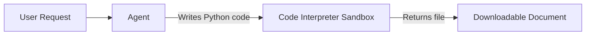
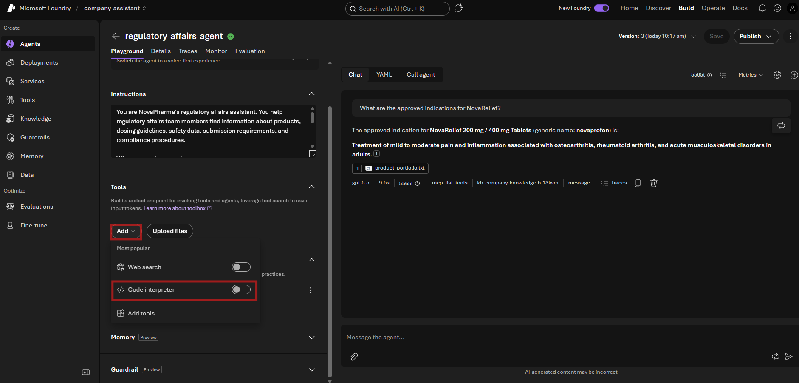
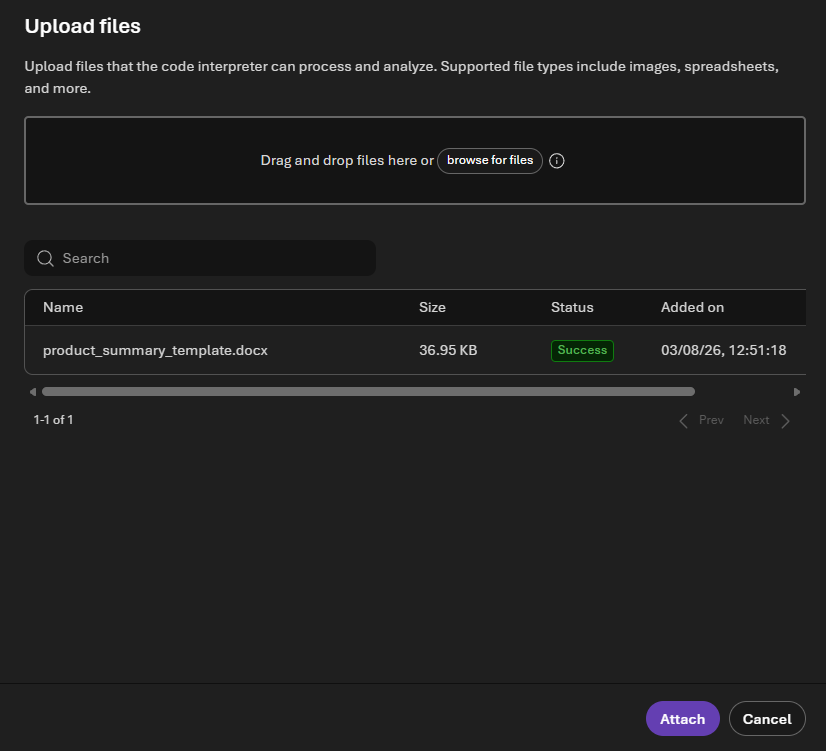
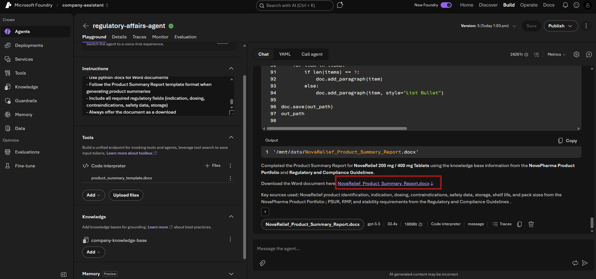

# Lab 4: Add the Code Interpreter Tool

[← Back to Workshop Overview](./README.md) | [← Previous: Lab 3](./lab-3-create-agent.md) | [Next: Lab 5 →](./lab-5-trace-agent.md)

---

**⏱️ Estimated Time**: 10-15 minutes

## Overview

In this lab you'll enable the **Code Interpreter** tool on your agent. Code Interpreter allows the agent to write and execute Python code in a sandboxed environment, meaning your agent can now generate files, fill in templates, analyze data, and produce Word/PDF documents on demand.

You'll also upload a **Product Summary Report template** that the agent will use to generate filled-in regulatory documents based on the knowledge base.


### How It Works



The agent decides when to use Code Interpreter based on the user's request. If someone asks for a document, chart, or data transformation, the agent writes Python code, executes it, and returns the result.

---

## Step 1: Navigate to Your Agent

1. In the **Microsoft Foundry** portal, go to **Build** > **Agents**
2. Click on `regulatory-affairs-agent` to open it

---

## Step 2: Enable Code Interpreter

1. In the agent **Playground**, find the **Tools** section in the left panel
2. Click the **Tools** header to expand it (if collapsed)
3. Click the **Add** dropdown button
4. In the popup menu, you'll see **Code interpreter** with a toggle switch
5. Click the toggle to **enable** Code Interpreter

> 💡 You should now see "Code interpreter" listed as an enabled tool alongside "Web search".



---

## Step 3: Update Agent Instructions

Update your agent instructions to let it know about its new capability. Replace the current instructions with:

```text
You are NovaPharma's regulatory affairs assistant. You help regulatory affairs team members find information about products, dosing guidelines, safety data, submission requirements, and compliance procedures.

Capabilities:
1. Knowledge Base: Answer questions using the connected product portfolio and regulatory guidelines
2. Document Generation: When asked to create or fill in a document, use the code interpreter to generate it. A Product Summary Report template is available as a reference for the standard format.

When answering questions:
- Always ground your answers in the knowledge base documents provided
- Be precise with dosing, contraindications, and regulatory timelines
- If you don't know the answer or can't find it in the documents, say so honestly
- When citing safety information, always mention the source document
- Use proper pharmaceutical terminology

When creating documents:
- Use python-docx for Word documents
- Follow the Product Summary Report template format when generating product summaries
- Include all required regulatory fields (indication, dosing, contraindications, safety data, storage)
- Always offer the document as a download
```

---

## Step 4: Upload the Template

Upload the product summary template so the agent can use it as a reference format:

1. In the **Tools** section (left panel), find **Code interpreter**
2. Click **+ Files** next to Code interpreter
3. In the "Upload files" dialog, click **browse for files**
4. Select `data/product_summary_template.docx` from this repository
5. Wait for the status to show **"Success"**
6. Click **Attach**

You should now see `product_summary_template.docx` listed under Code interpreter in the Tools section.

> ⚠️ Do NOT use the paperclip icon in the chat area. That only accepts images and PDFs. The **"+ Files"** button next to Code interpreter is the correct upload method for document templates.



---

Click **Save** in the top right. The version number will increment.

---

## Step 5: Test Document Generation

In the **Chat** panel on the right, try these prompts:

**Test 1: Fill in a product summary**
```
Fill in a Product Summary Report for NovaRelief using the information from our knowledge base.
```

The agent should:
1. Look up NovaRelief details in the knowledge base
2. Write Python code using `python-docx` to create a filled-in template
3. Return a downloadable Product Summary Report with all fields completed



**Test 2: Different product**
```
Generate a completed Product Summary Report for CardioShield.
```

**Test 3: Specific section**
```
Create a Word document summarizing the adverse reactions and drug interactions for all three NovaPharma products in a comparison table.
```

> 💡 After each response, you should see a file attachment that you can download. Click on it to verify the document was generated correctly.

---

## ✅ What You Accomplished

In this lab, you:

- ✅ Enabled the **Code Interpreter** built-in tool
- ✅ Uploaded a Product Summary Report template to Code Interpreter
- ✅ Updated agent instructions to include document generation
- ✅ Tested document creation with pharma-specific prompts
- ✅ Verified the agent can produce downloadable product summary reports

Your agent can now both answer regulatory questions AND produce filled-in document templates!

In Lab 5, you'll run one end-to-end request and use tracing to verify that the agent retrieves grounded knowledge before it generates the Word document.

---

## 💡 Tips

- **File uploads**: You can also upload files TO Code Interpreter (click the attach button in chat) for the agent to analyze
- **Charts and visualizations**: Try asking for matplotlib charts or data visualizations
- **CSV/Excel**: The agent can also generate spreadsheets and CSV files
- **Iterate**: If the document format isn't right, ask the agent to adjust it. It remembers the conversation context

---

[← Back to Workshop Overview](./README.md) | [← Previous: Lab 3](./lab-3-create-agent.md) | [Next: Lab 5 →](./lab-5-trace-agent.md)
