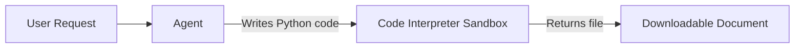

# Lab 4: Add the Code Interpreter Tool

[← Back to Workshop Overview](./README.md) | [← Previous: Lab 3](./lab-3-create-agent.md) | [Next: Lab 5 →](./lab-5-email-logic-app.md)

---

**⏱️ Estimated Time**: 10-15 minutes

## Overview

In this lab you'll enable the **Code Interpreter** tool on your agent. Code Interpreter allows the agent to write and execute Python code in a sandboxed environment, meaning your agent can now generate files, create charts, analyze data, and produce Word/PDF documents on demand.

This demonstrates how Foundry Agents go beyond just answering questions: they can **take action** and produce tangible outputs.

---

## 🎓 Key Concepts

### What are Agent Tools?

Tools extend what an agent can do beyond just answering questions. A tool is a function the agent can call when it determines the user's request requires an action. Examples:
- **Knowledge bases**: search company documents (Lab 3)
- **Code Interpreter**: write and run Python code to create files
- **Web Search**: search the internet for current information
- **Custom tools**: call external APIs (Lab 5)

### What is Code Interpreter?

Code Interpreter is a **built-in tool** that:
- Runs Python code in an isolated sandbox
- Can install and use common Python packages (e.g., `python-docx`, `matplotlib`, `pandas`)
- Produces downloadable files (Word docs, PDFs, images, CSVs)
- Has no access to your Azure resources or network (it's fully sandboxed)

### How It Works



The agent decides when to use Code Interpreter based on the user's request. If someone asks for a document, chart, or data transformation, the agent writes Python code, executes it, and returns the result.

---

## Step 1: Navigate to Your Agent

1. In the **Microsoft Foundry** portal, go to **Build** > **Agents**
2. Click on `company-chatbot` to open it

---

## Step 2: Enable Code Interpreter

1. In the agent **Playground**, find the **Tools** section in the left panel
2. Click the **Tools** header to expand it (if collapsed)
3. Click the **Add** dropdown button
4. In the popup menu, you'll see **Code interpreter** with a toggle switch
5. Click the toggle to **enable** Code Interpreter

> 💡 You should now see "Code interpreter" listed as an enabled tool alongside "Web search".

Alternatively, you can use the full tool dialog:
1. Click **Add** → **Add tools**
2. In the "Select a tool" dialog, find **Code interpreter**
3. Click it, then click **Add tool**

---

## Step 3: Update Agent Instructions

Update your agent instructions to let it know about its new capability. Replace the current instructions with:

```text
You are a helpful company assistant chatbot. You help employees find information about the company, its policies, and procedures.

Capabilities:
1. Knowledge Base: Answer questions using the connected company documents
2. Document Generation: When asked to create documents (Word, PDF, reports), use the code interpreter to generate them

When answering questions:
- Always ground your answers in the knowledge base documents provided
- Be concise and professional
- If you don't know the answer or can't find it in the documents, say so honestly
- Provide specific references to policies when applicable

When creating documents:
- Use python-docx for Word documents
- Include proper formatting (headings, bullet points, tables where appropriate)
- Always offer the document as a download
```

---

## Step 4: Save the Agent

Click **Save** in the top right. The version number will increment.

---

## Step 5: Test Document Generation

In the **Chat** panel on the right, try these prompts:

**Test 1: Simple document**
```
Create a Word document with a summary of our company's return policy.
```

The agent should:
1. Look up the return policy in the knowledge base
2. Write Python code using `python-docx` to create a .docx file
3. Return a downloadable link to the document

**Test 2: Formatted letter**
```
Generate a Word document with a welcome letter for a new employee named Sarah Johnson starting on August 15, 2026 in the Engineering department. Include our company name and key policies they should know about.
```

**Test 3: Data table**
```
Create a Word document with a table listing our shipping options and their details.
```

> 💡 After each response, you should see a file attachment that you can download. Click on it to verify the document was generated correctly.

---

## Step 6: Review the Trace

1. Click on the **Traces** tab at the top of the agent view
2. Find the most recent trace
3. Expand it to see:
   - The agent's decision to use Code Interpreter
   - The Python code it wrote
   - The execution result
   - The file output

This is useful for debugging if the document doesn't look right. You can see exactly what code was generated.

---

## ✅ What You Accomplished

In this lab, you:

- ✅ Enabled the **Code Interpreter** built-in tool
- ✅ Updated agent instructions to include document generation
- ✅ Tested document creation with multiple prompts
- ✅ Verified the agent can produce downloadable Word documents

Your agent can now both answer questions AND produce tangible outputs!

---

## 💡 Tips

- **File uploads**: You can also upload files TO Code Interpreter (click the attach button in chat) for the agent to analyze
- **Charts and visualizations**: Try asking for matplotlib charts or data visualizations
- **CSV/Excel**: The agent can also generate spreadsheets and CSV files
- **Iterate**: If the document format isn't right, ask the agent to adjust it. It remembers the conversation context

---

[← Back to Workshop Overview](./README.md) | [← Previous: Lab 3](./lab-3-create-agent.md) | [Next: Lab 5 →](./lab-5-email-logic-app.md)
