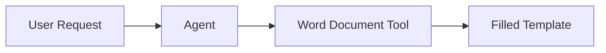

# Lab 4: Create a Word Document Tool

[← Back to Workshop Overview](./README.md) | [← Previous: Lab 3](./lab-3-create-knowledge-base.md) | [Next: Lab 5 →](./lab-5-email-logic-app.md)

---

**⏱️ Estimated Time**: 20-30 minutes

## Overview

In this lab you'll create a custom tool that your agent can use to fill in Word document templates. This demonstrates how Foundry Agents can go beyond chat — they can take action by generating structured outputs like documents.

---

## 🎓 Key Concepts

### What are Agent Tools?

Tools extend what an agent can do beyond just answering questions. A tool is a function the agent can call when it determines the user's request requires an action. Examples:
- Searching a knowledge base (you built this in Lab 3)
- Filling in a document template
- Calling an external API
- Triggering a workflow

### How This Tool Works

The agent extracts the relevant information from the conversation, passes it to the tool, and the tool produces a completed Word document.

---

## Instructions

> 🚧 **This lab will be completed during the workshop.** The instructions below outline the steps we'll walk through together.

### 1. TODO: Create the Word Document Template

### 2. TODO: Create the Azure Function / Tool endpoint

### 3. TODO: Register the tool in Foundry

### 4. TODO: Test the tool

---

### ✅ Checkpoint

You should now have:
- [ ] A Word document template ready
- [ ] A tool endpoint that fills in the template
- [ ] The tool registered in your Foundry project

---

[← Back to Workshop Overview](./README.md) | [← Previous: Lab 3](./lab-3-create-knowledge-base.md) | [Next: Lab 5 →](./lab-5-email-logic-app.md)
