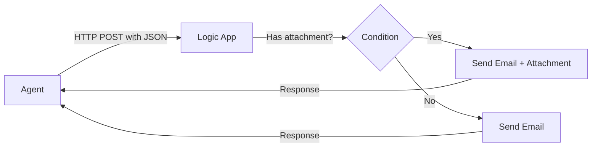
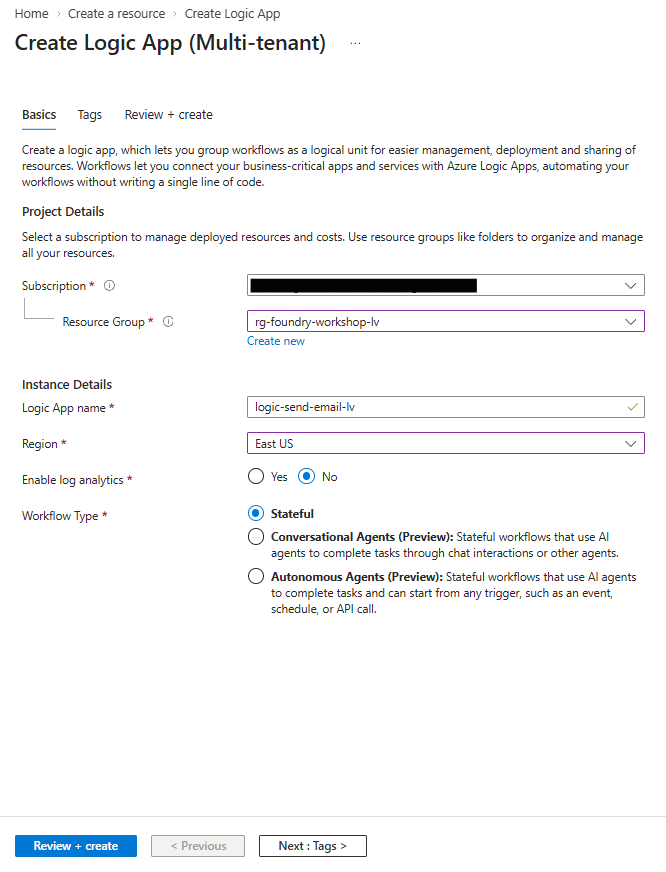
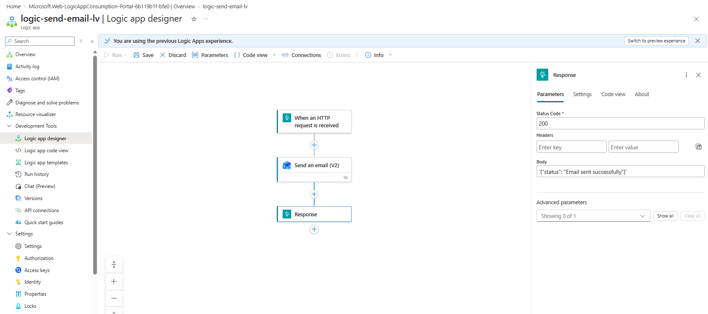
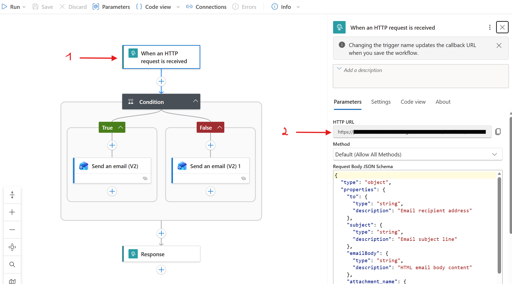

# Lab 5: Create a Custom API Tool with Logic Apps

[← Back to Workshop Overview](./README.md) | [← Previous: Lab 4](./lab-4-word-document-tool.md)

---

**⏱️ Estimated Time**: 20-30 minutes

## Overview

In this lab you'll create an **Azure Logic App** with an HTTP trigger that sends emails, then register it as a **custom tool** in your Foundry Agent. This demonstrates how agents can call external APIs to take real-world actions.

---

## 🎓 Key Concepts

### What is Azure Logic Apps?

Azure Logic Apps is a cloud service for automating workflows:
- **No-code/low-code**: Visual designer for building workflows
- **Connectors**: 400+ pre-built connectors (Office 365, Outlook, Teams, etc.)
- **Triggers**: Start workflows via HTTP requests, schedules, or events
- **Actions**: Send emails, create files, post messages, call APIs

### Why Logic Apps for Agent Tools?

Logic Apps are a great fit for agent tools because:
1. **HTTP trigger** → The agent calls them via a simple POST request
2. **No code** → The workflow is built visually in the portal
3. **Rich connectors** → Send emails, post to Teams, create calendar events
4. **Enterprise-ready** → Built-in retry, monitoring, and audit logging

### How the Custom Tool Works



The agent determines when to call the tool based on the user's request, formats the parameters as JSON, and sends them to the Logic App's HTTP endpoint.

---

## Step 1: Create a Logic App

1. Open the **Azure Portal** (portal.azure.com)
2. Click **+ Create a resource** on the left panel
3. Search for **Logic App** and click on **Create**
4. Select **Consumption** (Multi-tenant) as the hosting option and click **Select**
5. Fill in the details:
   - **Subscription**: Select your subscription
   - **Resource Group**: `rg-foundry-workshop-[yourname]`
   - **Logic App name**: `logic-send-email-[yourname]`
   - **Region**: East US
   - **Workflow Type**: Stateful
6. Click **Review + create** → **Create**



7. Once deployed, click **Go to resource**

---

## Step 2: Design the Workflow

1. In the Logic App, click **Logic app designer** (left menu under Development Tools)
2. You'll see the designer with a trigger step. Click **Add a trigger**
3. Select **Request** Under **Built-in-tools**.
4. Then select **When an HTTP request is received**.
In the **Request Body JSON Schema**, paste:

```json
{
  "type": "object",
  "properties": {
    "to": {
      "type": "string",
      "description": "Email recipient address"
    },
    "subject": {
      "type": "string",
      "description": "Email subject line"
    },
    "body": {
      "type": "string",
      "description": "Email body content"
    },
    "attachment_name": {
      "type": "string",
      "description": "Filename including extension (e.g. report.doc)"
    },
    "attachment_content": {
      "type": "string",
      "description": "HTML-formatted document content"
    }
  },
  "required": ["to", "subject", "body"]
}
```

4. In the visual workflow, click **+** → **Add an action**
5. Search for **Control** → Select **Condition**
6. In the Condition, configure:
   - Click **Choose a value** (left side), click the **lightning bolt** icon (⚡), and select **attachment_name**
   - Set the operator to **is not equal to**
   - Click **Choose a value** (right side) and type `null`
7. In the **True** branch (has attachment), click **Add an action**:
   - Search for **Office 365 Outlook** → Select **Send an email (V2)**
   - Sign in with your Microsoft 365 account when prompted
   - **To**: Click the lightning bolt icon and select **to**
   - **Subject**: Click the lightning bolt icon and select **subject**
   - **Body**: Click the lightning bolt icon and select **body**
   - Under **Advanced parameters**, click **Show all**. Under Attachments, click **Add new item**. Set **Name** to `attachment_name` (lightning bolt) and **Attachments Content** to the expression `base64(triggerBody()?['attachment_content'])` (click the **fx** button to enter expression mode)
8. In the **False** branch (no attachment), click **Add an action**:
   - Search for **Office 365 Outlook** → Select **Send an email (V2)**
   - **To**: lightning bolt → **to**
   - **Subject**: lightning bolt → **subject**
   - **Body**: lightning bolt → **body**
   - (No attachments needed here)
9. Below the Condition block, click **+** → **Add an action** → Search for **Response** → Select **Response**
10. Configure the response:
    - **Status Code**: `200`
    - **Body**: `{"status": "Email sent successfully"}`
11. Click **Save**


---

## Step 3: Get the HTTP URL

After saving, the HTTP trigger will show a **HTTP POST URL** at the top of the trigger step.

1. Click on the "When a HTTP request is received" step
2. Copy the **HTTP POST URL**. You'll need this for the next step



> ⚠️ **Keep this URL secure**. It contains a SAS token that allows anyone with it to trigger your Logic App.

---

## Step 4: Create the Tool Definition

Now register this Logic App as a custom tool directly from your agent:

1. Go back to the **Microsoft Foundry** portal
2. Navigate to **Build** > **Agents** > `regulatory-affairs-agent`
3. In the **Tools** section, click **Add** > **Custom tool** > **OpenAPI**
4. Fill in the details:
   - **Name**: `SendEmail`
   - **Description**: `Sends an email to a specified recipient with a subject and body. Use this when the user asks to send, compose, or draft an email.`
   - **Authentication method**: **Anonymous**
5. In the **OpenAPI 3.0+ schema** field, paste the following JSON. Replace the `url` and path with your own Logic App URL from Step 3:

> 💡 To split your URL: everything before `/invoke` goes in `servers.url`, and `/invoke?...` (including all query parameters) becomes the path key.

```json
{
  "openapi": "3.0.0",
  "info": {
    "title": "Send Email Tool",
    "description": "Sends an email via Logic App with optional Word document attachment",
    "version": "1.0.0"
  },
  "servers": [
    {
      "url": "https://prod-XX.eastus.logic.azure.com:443/workflows/YOUR_WORKFLOW_ID/triggers/When_an_HTTP_request_is_received/paths"
    }
  ],
  "paths": {
    "/invoke?api-version=2016-10-01&sp=%2Ftriggers%2FWhen_an_HTTP_request_is_received%2Frun&sv=1.0&sig=YOUR_SIG_HERE": {
      "post": {
        "operationId": "sendEmail",
        "summary": "Send an email to a recipient",
        "description": "Sends an email with the specified recipient, subject, and body",
        "requestBody": {
          "required": true,
          "content": {
            "application/json": {
              "schema": {
                "type": "object",
                "properties": {
                  "to": {
                    "type": "string",
                    "description": "Email recipient address"
                  },
                  "subject": {
                    "type": "string",
                    "description": "Email subject line"
                  },
                  "body": {
                    "type": "string",
                    "description": "Email body content"
                  },
                  "attachment_name": {
                    "type": "string",
                    "description": "Filename for the attachment ending in .doc (e.g. Product_Summary_NovaRelief.doc)"
                  },
                  "attachment_content": {
                    "type": "string",
                    "description": "HTML-formatted content for the Word document. Use proper HTML tags (html, head, body, h1, h2, p, table, etc). Do NOT base64 encode. The server handles encoding."
                  }
                },
                "required": ["to", "subject", "body"]
              }
            }
          }
        },
        "responses": {
          "200": {
            "description": "Email sent successfully"
          }
        }
      }
    }
  }
}
```

6. Click **Create tool**

---

## Step 5: Update Agent Instructions

Update instructions to include the email capability:

```text
You are NovaPharma's regulatory affairs assistant. You help regulatory affairs team members find information about products, dosing guidelines, safety data, submission requirements, and compliance procedures.

Capabilities:
1. Knowledge Base: Answer questions using the connected product portfolio and regulatory guidelines
2. Document Generation: When asked to create or fill in a document, use the code interpreter to generate it. A Product Summary Report template is available as a reference for the standard format.
3. Email: When asked to send an email, use the SendEmail tool. Always confirm the recipient, subject, and body with the user before sending.
4. Email with attachment: When asked to email a generated document as a Word file, use code interpreter to generate the document content as a well-formatted HTML string (with <html>, <head>, <body>, <h1>, <h2>, <p>, <table> tags as appropriate). Then call SendEmail with attachment_name ending in .doc (e.g. "Product_Summary_NovaRelief.doc") and attachment_content set to the HTML string. Do NOT base64 encode it. The server handles encoding, and Word opens HTML-based .doc files natively.

When answering questions:
- Always ground your answers in the knowledge base documents provided
- Be precise with dosing, contraindications, and regulatory timelines
- If you don't know the answer or can't find it in the documents, say so honestly
- Use proper pharmaceutical terminology

When sending emails:
- Always confirm details with the user before actually sending
- Format the email body professionally
- Include relevant information from the knowledge base when applicable
```

Click **Save** on the top right.

---

## Step 6: Test the Email Tool

In the chat panel, try:

**Test 1: Direct email request** - replace with a real email address
```
Send an email to test@example.com with the subject "Hello from the workshop" and body "This is a test email from our Foundry agent!"
```

The agent should:
1. Recognize this as an email request
2. Confirm the details with you
3. Call the `send-email` tool
4. Report success or failure

**Test 2: Knowledge + email combo** - replace with a real email address
```
Look up the contraindications for CardioShield and send a summary to regulatory@novapharma.eu
```

The agent should:
1. Query the knowledge base for CardioShield contraindications
2. Compose an email with the summary
3. Confirm before sending
4. Call the email tool

**Test 3: Generate document and email it** - replace with a real email address
```
Generate a product summary report for NovaRelief and email it as a Word document to regulatory@novapharma.eu
```

The agent should:
1. Use Code Interpreter to generate the report as an HTML document
2. Ask you to confirm before sending
3. Call the SendEmail tool with `attachment_name` (e.g. "Product_Summary_NovaRelief.doc") and `attachment_content` (the HTML string)
4. You should receive the email with a .doc file attached that opens in Microsoft Word

> 💡 **Why HTML instead of .docx?** Foundry's OpenAPI tool calls have a parameter size limit of ~14,000 characters. A real `.docx` file is binary, and even a simple report becomes ~50,000+ characters when base64-encoded, which gets truncated. By sending HTML content (~5,000 characters for the same report) with a `.doc` extension, we stay well within the limit. Word opens HTML-based `.doc` files natively, so the recipient experience is the same.

---

## ✅ What You Accomplished

In this lab, you:

- ✅ Created an Azure Logic App with an HTTP trigger
- ✅ Configured an Office 365 email action with conditional attachment support
- ✅ Registered the Logic App as a custom tool in Foundry
- ✅ Connected the tool to your agent
- ✅ Tested agent-triggered email sending
- ✅ Tested generating a document and emailing it as an attachment

Your agent can now send emails on behalf of the user, a real-world action triggered by natural language!

---

## 💡 Tips

- **Testing without sending**: Use a personal email address for testing, or add a condition in the Logic App to skip sending in dev mode
- **Logic App monitoring**: Check the Logic App's **Run history** in the Azure Portal to see execution details
- **Error handling**: Add a "Condition" step in the Logic App to handle cases where the email connector fails
- **Other actions**: Logic Apps can also post to Teams, create calendar events, write to SharePoint, and more. Any of these could be registered as additional tools

---

## 🔒 Security Considerations

- The Logic App HTTP URL contains a SAS key. Treat it like a password
- In production, use Azure API Management or managed identity instead of SAS URLs
- Consider adding input validation in the Logic App to prevent misuse
- The Office 365 connector uses delegated permissions tied to the signed-in account

---

[← Back to Workshop Overview](./README.md) | [← Previous: Lab 4](./lab-4-word-document-tool.md)
