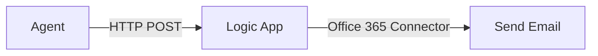

# Lab 5: Create an Email Action with Logic Apps

[← Back to Workshop Overview](./README.md) | [← Previous: Lab 4](./lab-4-word-document-tool.md) | [Next: Lab 6 →](./lab-6-create-test-agent.md)

---

**⏱️ Estimated Time**: 15-20 minutes

## Overview

In this lab you'll create an Azure Logic App that sends emails. Your agent will be able to trigger this Logic App as an action — allowing it to send emails on behalf of the user when asked.

---

## 🎓 Key Concepts

### What is Azure Logic Apps?

Azure Logic Apps is a cloud service for automating workflows and integrating services:
- **No-code/low-code**: Visual designer for building workflows
- **Connectors**: 400+ pre-built connectors (Office 365, Outlook, Teams, etc.)
- **Triggers**: Start workflows via HTTP requests, schedules, or events
- **Actions**: Send emails, create files, call APIs, etc.

### Why Logic Apps for Agent Actions?

Logic Apps are a great fit for agent tools because:
1. **HTTP trigger**: The agent can call them via a simple HTTP request
2. **No code to maintain**: The workflow is managed in Azure
3. **Rich connectors**: Send emails, post to Teams, create calendar events — all without writing integration code
4. **Enterprise-ready**: Built-in retry, monitoring, and audit logging

### How the Email Action Works

---

## Instructions

> 🚧 **This lab will be completed during the workshop.** The instructions below outline the steps we'll walk through together.

### 1. TODO: Create a Logic App (Consumption)

### 2. TODO: Add an HTTP trigger

### 3. TODO: Add the "Send an email (V2)" action with Office 365 connector

### 4. TODO: Configure the email template (recipient, subject, body from trigger)

### 5. TODO: Test the Logic App manually

### 6. TODO: Register the Logic App as a tool in Foundry

---

### ✅ Checkpoint

You should now have:
- [ ] Logic App created with HTTP trigger
- [ ] Office 365 email action configured
- [ ] Logic App tested and working
- [ ] Logic App registered as a tool in your Foundry project

---

[← Back to Workshop Overview](./README.md) | [← Previous: Lab 4](./lab-4-word-document-tool.md) | [Next: Lab 6 →](./lab-6-create-test-agent.md)
