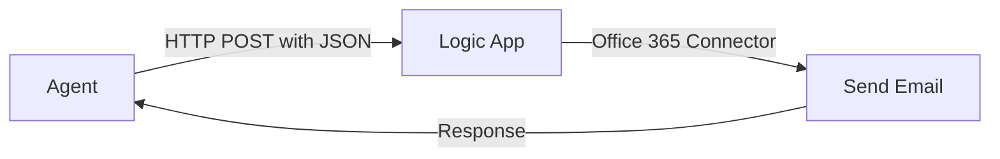

# Lab 5: Create a Custom API Tool with Logic Apps

[← Back to Workshop Overview](./README.md) | [← Previous: Lab 4](./lab-4-word-document-tool.md) | [Next: Lab 6 →](./lab-6-final-agent.md)

---

**⏱️ Estimated Time**: 20-30 minutes

## Overview

In this lab you'll create an **Azure Logic App** with an HTTP trigger that sends emails, then register it as a **custom tool** in your Foundry Agent. This demonstrates how agents can call external APIs to take real-world actions.

---

## 🎓 Key Concepts

### What is Azure Logic Apps?

Azure Logic Apps is a cloud service for automating workflows:
- **No-code/low-code**: Visual designer for building workflows
- **Connectors**: 400+ pre-built connectors (Office 365, Outlook, Teams, etc.)
- **Triggers**: Start workflows via HTTP requests, schedules, or events
- **Actions**: Send emails, create files, post messages, call APIs

### Why Logic Apps for Agent Tools?

Logic Apps are a great fit for agent tools because:
1. **HTTP trigger** → The agent calls them via a simple POST request
2. **No code** → The workflow is built visually in the portal
3. **Rich connectors** → Send emails, post to Teams, create calendar events
4. **Enterprise-ready** → Built-in retry, monitoring, and audit logging

### How the Custom Tool Works



The agent determines when to call the tool based on the user's request, formats the parameters as JSON, and sends them to the Logic App's HTTP endpoint.

---

## Step 1: Create a Logic App

1. Open the **Azure Portal** (portal.azure.com)
2. Click **+ Create a resource**
3. Search for **Logic App** and select it
4. Click **Create**
5. Fill in the details:
   - **Subscription**: Select your subscription
   - **Resource Group**: `rg-foundry-workshop-[yourname]`
   - **Logic App name**: `logic-send-email-[yourname]`
   - **Region**: East US 2
   - **Plan type**: **Consumption** (pay per execution)
6. Click **Review + create** → **Create**
7. Once deployed, click **Go to resource**

---

## Step 2: Design the Workflow

1. In the Logic App, click **Logic app designer** (left menu under Development Tools)
2. You'll see the designer with a trigger step. Select **When a HTTP request is received**
3. In the **Request Body JSON Schema**, paste:

```json
{
  "type": "object",
  "properties": {
    "to": {
      "type": "string",
      "description": "Email recipient address"
    },
    "subject": {
      "type": "string",
      "description": "Email subject line"
    },
    "body": {
      "type": "string",
      "description": "Email body content"
    }
  },
  "required": ["to", "subject", "body"]
}
```

4. Click **+ New step**
5. Search for **Office 365 Outlook** → Select **Send an email (V2)**
6. Sign in with your Microsoft 365 account when prompted
7. Configure the email action:
   - **To**: Click in the field → select `to` from Dynamic content
   - **Subject**: Select `subject` from Dynamic content
   - **Body**: Select `body` from Dynamic content
8. Click **+ New step** → Search for **Response** → Select **Response**
9. Configure the response:
   - **Status Code**: `200`
   - **Body**: `{"status": "Email sent successfully"}`
10. Click **Save**

---

## Step 3: Get the HTTP URL

After saving, the HTTP trigger will show a **HTTP POST URL** at the top of the trigger step.

1. Click on the "When a HTTP request is received" step
2. Copy the **HTTP POST URL** — you'll need this for the next step

> ⚠️ **Keep this URL secure** — it contains a SAS token that allows anyone with it to trigger your Logic App.

---

## Step 4: Create the Tool Definition

Now register this Logic App as a custom tool in Foundry:

1. Go back to the **Microsoft Foundry** portal
2. Navigate to **Build** > **Tools** (left navigation)
3. Click **+ New tool**
4. Select **Custom tool** (or **OpenAPI**)
5. Fill in the details:
   - **Name**: `send-email`
   - **Description**: `Sends an email to a specified recipient with a subject and body. Use this when the user asks to send, compose, or draft an email.`
6. For the tool definition, provide the OpenAPI spec:

```yaml
openapi: 3.0.0
info:
  title: Send Email Tool
  version: 1.0.0
paths:
  /send:
    post:
      operationId: sendEmail
      summary: Send an email to a recipient
      description: Sends an email with the specified recipient, subject, and body
      requestBody:
        required: true
        content:
          application/json:
            schema:
              type: object
              properties:
                to:
                  type: string
                  description: Email recipient address
                subject:
                  type: string
                  description: Email subject line
                body:
                  type: string
                  description: Email body content in plain text or HTML
              required:
                - to
                - subject
                - body
      responses:
        '200':
          description: Email sent successfully
```

7. Set the **Server URL** to your Logic App HTTP POST URL (without the query parameters — the full URL acts as the endpoint)
8. Click **Save**

---

## Step 5: Connect the Tool to Your Agent

1. Go to **Build** > **Agents** > `company-chatbot`
2. In the **Tools** section, click **Add** → **Add tools**
3. Switch to the **Custom** tab (or find your tool in the list)
4. Select `send-email`
5. Click **Add tool**

---

## Step 6: Update Agent Instructions

Update instructions to include the email capability:

```text
You are a helpful company assistant chatbot. You help employees find information about the company, its policies, and procedures.

Capabilities:
1. Knowledge Base: Answer questions using the connected company documents
2. Document Generation: When asked to create documents (Word, PDF, reports), use the code interpreter to generate them
3. Email: When asked to send an email, use the send-email tool. Always confirm the recipient, subject, and body with the user before sending.

When answering questions:
- Always ground your answers in the knowledge base documents provided
- Be concise and professional
- If you don't know the answer or can't find it in the documents, say so honestly
- Provide specific references to policies when applicable

When sending emails:
- Always confirm details with the user before actually sending
- Format the email body professionally
- Include relevant information from the knowledge base when applicable
```

Click **Save**.

---

## Step 7: Test the Email Tool

In the chat panel, try:

**Test 1 — Direct email request:**
```
Send an email to test@example.com with the subject "Hello from the workshop" and body "This is a test email from our Foundry agent!"
```

The agent should:
1. Recognize this as an email request
2. Confirm the details with you
3. Call the `send-email` tool
4. Report success or failure

**Test 2 — Knowledge + email combo:**
```
Look up our return policy and send a summary to customer@example.com
```

The agent should:
1. Query the knowledge base for the return policy
2. Compose an email with the summary
3. Confirm before sending
4. Call the email tool

---

## ✅ What You Accomplished

In this lab, you:

- ✅ Created an Azure Logic App with an HTTP trigger
- ✅ Configured an Office 365 email action
- ✅ Registered the Logic App as a custom tool in Foundry
- ✅ Connected the tool to your agent
- ✅ Tested agent-triggered email sending

Your agent can now send emails on behalf of the user — a real-world action triggered by natural language!

---

## 💡 Tips

- **Testing without sending**: Use a personal email address for testing, or add a condition in the Logic App to skip sending in dev mode
- **Logic App monitoring**: Check the Logic App's **Run history** in the Azure Portal to see execution details
- **Error handling**: Add a "Condition" step in the Logic App to handle cases where the email connector fails
- **Other actions**: Logic Apps can also post to Teams, create calendar events, write to SharePoint, and more — any of these could be registered as additional tools

---

## 🔒 Security Considerations

- The Logic App HTTP URL contains a SAS key — treat it like a password
- In production, use Azure API Management or managed identity instead of SAS URLs
- Consider adding input validation in the Logic App to prevent misuse
- The Office 365 connector uses delegated permissions tied to the signed-in account

---

[← Back to Workshop Overview](./README.md) | [← Previous: Lab 4](./lab-4-word-document-tool.md) | [Next: Lab 6 →](./lab-6-final-agent.md)
