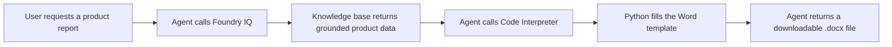
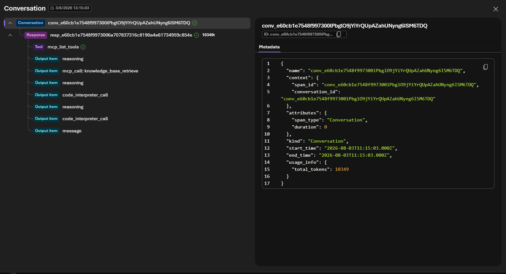

# Lab 5: Trace Knowledge Retrieval and Document Generation

[← Back to Workshop Overview](./README.md) | [← Previous: Lab 4](./lab-4-word-document-tool.md)

---

**⏱️ Estimated Time**: 10-15 minutes

## Overview

In this lab, you'll test the complete regulatory-document workflow and inspect its trace. The trace should show that your agent first retrieves grounded product information from Foundry IQ and then uses Code Interpreter to create a Word document from the attached template.

Tracing makes the agent's decisions and tool calls visible. It helps you verify that the generated document is grounded in approved source material and diagnose failures without guessing.

---

## 🎓 Key Concepts

### What is a Trace?

A trace records one end-to-end agent request. It contains a timeline of operations, often called spans, such as:

- The user's request
- The model's reasoning and tool selection
- Foundry IQ knowledge retrieval
- Code Interpreter execution
- The final response and generated file

### Expected Execution Flow



The important validation is the order. The knowledge retrieval must happen before document generation so the report is based on the prepared NovaPharma content.

---

## Step 1: Confirm Tracing is Connected

1. In the **Microsoft Foundry** portal, select your project: `company-assistant-[yourname]`
2. Go to **Build** > **Agents** and open `regulatory-affairs-agent`
3. Open the **Traces** tab
4. Confirm that the Application Insights connection from Lab 3 is active

If tracing is not connected, click **Connect**, select the Application Insights resource you created in Lab 3, and complete the connection.

---

## Step 2: Start a Clean Test Conversation

1. Return to the agent **Playground**
2. Start a new conversation so the trace contains only the workflow you want to inspect
3. Enter this prompt:

   ```text
   Create a completed Product Summary Report for NovaRelief. First retrieve the required product, dosing, contraindication, safety, storage, and regulatory information from the connected knowledge base. Then use the attached product_summary_template.docx and Code Interpreter to generate a downloadable Word document. Do not rely on general knowledge for missing fields; mark them as not found in the source documents.
   ```

4. Wait for the agent to finish
5. Confirm that the response includes a downloadable `.docx` file
6. Download and open the document, then verify that it follows the Product Summary Report template and contains NovaRelief information

> 💡 Keep this conversation open. Its timestamp and prompt will help you identify the matching trace.

---

## Step 3: Find the Trace

1. Open the **Traces** tab
2. Refresh the view if the latest request is not visible
3. Locate the trace that matches your test prompt and timestamp
4. Open the trace detail or span timeline

Telemetry can take 2-5 minutes to appear. If the conversation is visible before the trace, wait briefly and refresh the Traces view.

---

## Step 4: Inspect Knowledge Retrieval

In the trace timeline, find the knowledge or tool operation associated with **Foundry IQ**, the connected knowledge base, or retrieval.

1. Expand the retrieval operation
2. Confirm that it occurs before Code Interpreter
3. Inspect the available input and output details
4. Verify that the retrieved content includes NovaRelief facts needed by the report, such as indication, dosing, contraindications, safety data, or storage requirements
5. Look for a reference to `company-knowledge-base` or the prepared source documents

The exact span labels can vary by portal version. Use the operation order and the displayed tool or knowledge-base details to identify retrieval.

### Retrieval Checkpoint

- [ ] A knowledge retrieval operation is present
- [ ] It uses the connected Foundry IQ knowledge base
- [ ] It returns NovaRelief information
- [ ] It occurs before document generation

---

## Step 5: Inspect Word Document Generation

Next, find the **Code Interpreter** operation in the same trace.

1. Expand the Code Interpreter operation
2. Confirm that it occurs after knowledge retrieval
3. Inspect the generated Python code or execution details, when available
4. Look for use of `python-docx` and the attached `product_summary_template.docx`
5. Confirm that execution completed successfully and produced a `.docx` file
6. Inspect the final response span and verify that it returns the generated document to the user



### Generation Checkpoint

- [ ] Code Interpreter runs after knowledge retrieval
- [ ] The template or its structure is used
- [ ] The Python execution succeeds
- [ ] A Word document is produced
- [ ] The final response contains the downloadable file

---

## Step 6: Explain the Trace

Use the trace to summarize what the agent did:

1. The agent interpreted the request as requiring grounded information and a document
2. Foundry IQ retrieved NovaRelief data from the prepared knowledge source
3. The model passed the grounded information into the document-generation step
4. Code Interpreter used Python to fill the Word template
5. The agent returned the generated file

This sequence demonstrates an agentic workflow rather than a single model response. The agent chooses and coordinates different capabilities while the trace provides an audit trail.

---

## Troubleshooting

### No Knowledge Retrieval Operation

- Confirm that `company-knowledge-base` is connected in the agent's **Knowledge** section
- Check that the knowledge source status is **Active**
- Use the exact test prompt, which explicitly requires retrieval before generation
- Verify that the answer includes citations or source references

### Code Interpreter Runs Before Retrieval

- Confirm that the agent instructions say to ground document content in the knowledge base
- Add `First retrieve... Then generate...` to the prompt
- Start a new conversation and test again

### No Word File is Produced

- Confirm that Code Interpreter is enabled
- Confirm that `product_summary_template.docx` is attached under Code Interpreter, not only in the chat
- Open the Code Interpreter span and inspect the execution error
- Correct the agent instructions or template attachment, save the agent, and rerun the test

### Trace is Missing

- Confirm that Application Insights is connected
- Wait 2-5 minutes, then refresh
- Check that you are viewing traces for the correct project and agent

---

## ✅ What You Accomplished

In this lab, you:

- ✅ Ran the complete grounded document-generation workflow
- ✅ Located the matching agent trace
- ✅ Verified that Foundry IQ retrieved knowledge before document generation
- ✅ Inspected the Code Interpreter execution and Word output
- ✅ Used trace evidence to validate and troubleshoot agent behavior

You now have a regulatory affairs agent that retrieves approved knowledge, creates a Word document from a template, and exposes the full execution path through tracing.

---

[← Back to Workshop Overview](./README.md) | [← Previous: Lab 4](./lab-4-word-document-tool.md)
