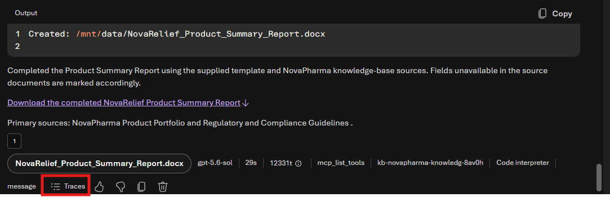
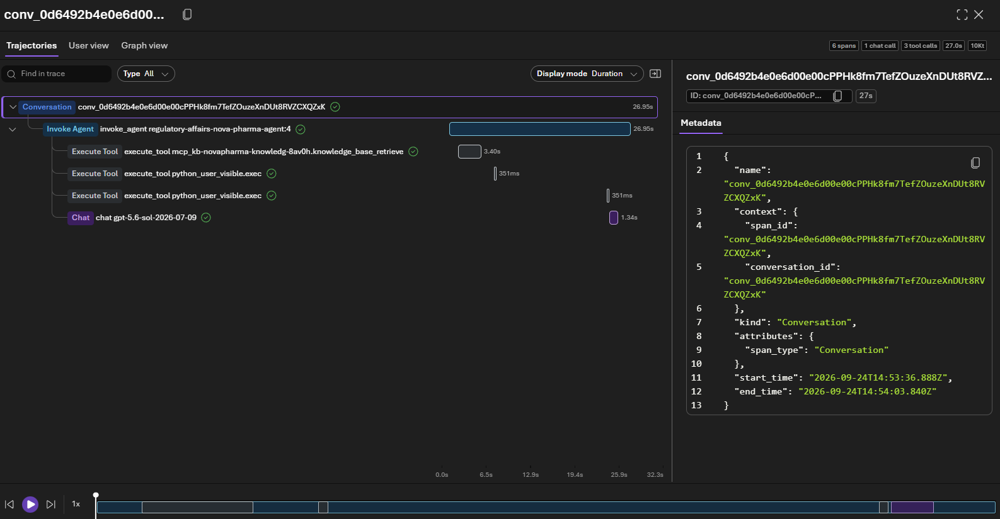
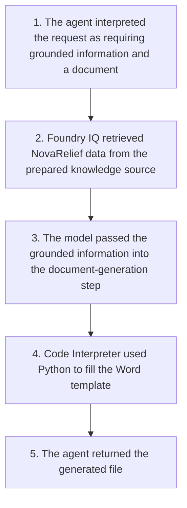
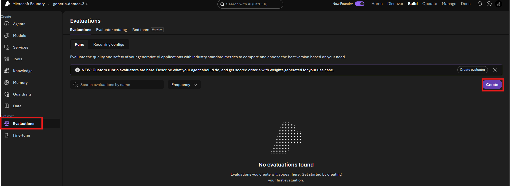
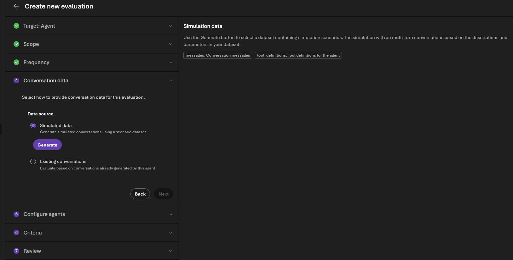

# Lab 5: Trace and Evaluate the Agent Workflow

[← Back to Workshop Overview](./README.md) | [← Previous: Lab 4](./lab-4-word-document-tool.md)

---

**⏱️ Estimated Time**: 20-25 minutes

## Overview

In this lab, you'll test the complete regulatory-document workflow, inspect its trace, and run an evaluation against the captured interaction. The trace should show that your agent first retrieves grounded product information from Foundry IQ and then uses Code Interpreter to create a Word document from the attached template.

Tracing makes the agent's decisions and tool calls visible. Evaluation adds repeatable quality scores and explanations so you can assess the response instead of relying only on visual inspection.


---

## Step 1: Confirm Tracing is Connected

1. In the **Microsoft Foundry** portal, select your project: `company-assistant-[yourname]`
2. Go to **Build** > **Agents** and open `regulatory-affairs-agent`
3. Open the **Traces** tab
4. Confirm that the Application Insights connection from Lab 3 is active and that you see traces there

If tracing is not connected, click **Connect**, select the Application Insights resource you created in Lab 3, and complete the connection.

---

## Step 2: Start a Clean Test Conversation and Look at the Traces

1. Return to the agent **Playground**
2. Start a new conversation so the trace contains only the workflow you want to inspect
3. Enter this prompt:

   ```text
   Create a completed Product Summary Report for NovaRelief. First retrieve the required product, dosing, contraindication, safety, storage, and regulatory information from the connected knowledge base. Then use the attached product_summary_template.docx and Code Interpreter to generate a downloadable Word document. Do not rely on general knowledge for missing fields; mark them as not found in the source documents.
   ```

4. Wait for the agent to finish
5. Confirm that the response includes a downloadable `.docx` file
6. At the bottom of the answer you will see **Traces**. Click on this and this will open the trace for this request. 

   

7. In the trace you can see the tools being called and observe that first hte knowledge base was called to get the required info and that after code interpreter was used to generate the file

   


---

## Step 3: Inspect Knowledge Retrieval and code interpreter

In the trace timeline, find the knowledge or tool operation associated with **Foundry IQ**, the connected knowledge base, or retrieval.

1. Expand the retrieval operation
2. Confirm that it occurs before Code Interpreter
3. Inspect the available input and output details
4. Verify that the retrieved content includes NovaRelief facts needed by the report, such as indication, dosing, contraindications, safety data, or storage requirements
5. Expand the Code Interpreter operations
6. Inspect the generated Python code or execution details, when available
7. Inspect the final response span and verify that it returns the generated document to the user

So to summarize, the agent did the following:



This sequence demonstrates an agentic workflow rather than a single model response. The agent chooses and coordinates different capabilities while the trace provides an audit trail.

---

## Step 7: Evaluate the Captured Trace

Now evaluate similar interactions with Microsoft Foundry's built-in evaluators.

1. In the left navigation, select **Evaluation**
2. Click **Create**

   

3. For the evaluation target, select **Agent**, select `regulatory-affairs-agent`, and then select **Next**.
4. For **Scope**, select **Full conversations**, and then select **Next**.
5. For **Frequency**, select **One time**, and then select **Next**.
6. Under **Conversation data**, choose between **Simulated data** and **Existing conversations**. 
    - **Existing conversations** evaluates interactions already captured by the agent, while 
    - **Simulated data** generates test conversations when little or no real traffic is available. 
    
    Because this workshop has only a limited number of existing conversations, select **Simulated data**, then click **Generate**.

   
   
7. In **Create conversations**, configure the simulation:
   1. Click **Upload dataset** and upload [`data/evaluation/novarelief_simulation_scenarios.jsonl`](./data/evaluation/novarelief_simulation_scenarios.jsonl)
   2. Select the uploaded dataset. It contains 30 scenarios covering document generation, groundedness, dosing, special populations, safety, pharmacovigilance, regulatory operations, quality, product information, and clarification behavior.
   3. Select an available simulator model. Use `gpt-4.1` when available.
   4. Set **Number of simulated conversations per scenario** to `1` and **Number of turns per conversation** to `6`.
   5. Select **Confirm**.
8. Select these conversation evaluators when available:
   - **Task Completion**: Checks whether the agent completed the requested workflow
   - **Customer Satisfaction**: Estimates whether the interaction met the user's needs
   - **Coherence**: Checks whether the conversation is logically consistent
   - **Groundedness**: Checks whether the response is supported by the retrieved context
9. Name the evaluation `novarelief-grounded-report-evaluation`
10. Review the configuration, then click **Submit**

The evaluation can take a few minutes. Its status changes from **In Progress** to **Completed**, **Partial**, or **Failed**.

> 💡 AI-assisted evaluators use a judge model and consume model quota. The available evaluators can vary by project configuration and portal version.

---

## Step 8: Review the Evaluation Results

1. From **Evaluation**, open `novarelief-grounded-report-evaluation`
2. Review the aggregate score for each evaluator
3. Open the evaluated row to see the query, response, score, and explanation
4. Confirm that the **Groundedness** explanation recognizes support from the retrieved NovaRelief context
5. Confirm that the **Relevance** explanation reflects the requested report task
6. Review low scores or failed evaluators alongside the trace to identify whether the issue came from retrieval, tool execution, or the final response

Do not treat a score by itself as proof that the document is correct. Use the evaluator explanation, the retrieved source content, the generated document, and the trace together.

### Evaluation Checkpoint

- [ ] The evaluation completed successfully
- [ ] The selected trace contains the expected query, response, and retrieved context
- [ ] Groundedness and relevance results include understandable explanations
- [ ] Any low score can be linked to evidence in the trace or generated document

---

## Troubleshooting

### No Knowledge Retrieval Operation

- Confirm that `company-knowledge-base` is connected in the agent's **Knowledge** section
- Check that the knowledge source status is **Active**
- Use the exact test prompt, which explicitly requires retrieval before generation
- Verify that the answer includes citations or source references

### Code Interpreter Runs Before Retrieval

- Confirm that the agent instructions say to ground document content in the knowledge base
- Add `First retrieve... Then generate...` to the prompt
- Start a new conversation and test again

### No Word File is Produced

- Confirm that Code Interpreter is enabled
- Confirm that `product_summary_template.docx` is attached under Code Interpreter, not only in the chat
- Open the Code Interpreter span and inspect the execution error
- Correct the agent instructions or template attachment, save the agent, and rerun the test

### Trace is Missing

- Confirm that Application Insights is connected
- Wait 2-5 minutes, then refresh
- Check that you are viewing traces for the correct project and agent

### Evaluation is Partial or Failed

- Open the run details and identify which evaluator failed
- Confirm that all required fields are mapped
- For **Groundedness**, confirm that **context** maps to the retrieved Foundry IQ content
- Confirm that the judge model is available and has sufficient quota
- Rerun the evaluation after correcting the configuration

---

## ✅ What You Accomplished

In this lab, you:

- ✅ Ran the complete grounded document-generation workflow
- ✅ Located the matching agent trace
- ✅ Verified that Foundry IQ retrieved knowledge before document generation
- ✅ Inspected the Code Interpreter execution and Word output
- ✅ Used trace evidence to validate and troubleshoot agent behavior
- ✅ Evaluated the captured interaction for groundedness, relevance, coherence, and fluency
- ✅ Reviewed evaluator scores and explanations alongside the trace

You now have a regulatory affairs agent that retrieves approved knowledge, creates a Word document from a template, exposes the full execution path through tracing, and can be evaluated with repeatable quality measures.

---

[← Back to Workshop Overview](./README.md) | [← Previous: Lab 4](./lab-4-word-document-tool.md)
