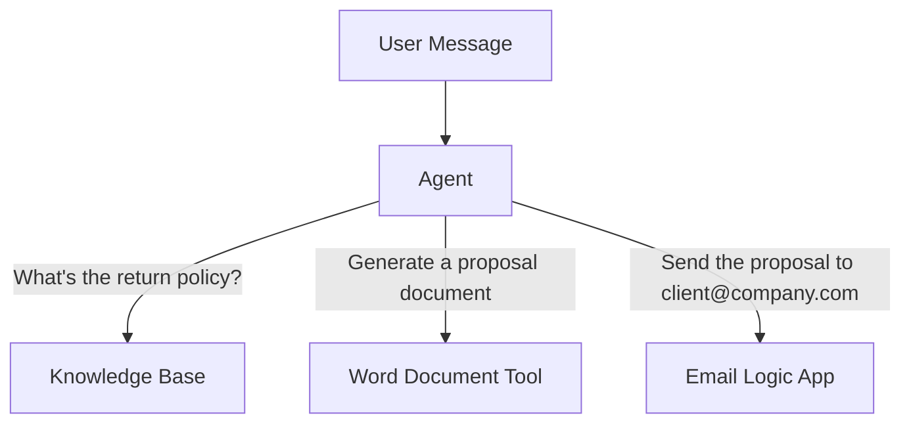

# Lab 6: Create and Test the Agent

[← Back to Workshop Overview](./README.md) | [← Previous: Lab 5](./lab-5-email-logic-app.md)

---

**⏱️ Estimated Time**: 15-20 minutes

## Overview

In this final lab you'll create the Foundry Agent that ties everything together. Your agent will have access to:
- **Knowledge base** (Foundry IQ) — to answer questions from your documents
- **Word document tool** — to fill in document templates
- **Email action** (Logic App) — to send emails

You'll configure the agent's instructions, connect all tools, and test it end-to-end.

---

## 🎓 Key Concepts

### What is a Foundry Agent?

A Foundry Agent is an AI-powered assistant that can:
- **Understand** natural language questions
- **Reason** about which tools to use
- **Act** by calling tools and returning results
- **Cite** sources so users know where answers come from

### Multi-Tool Agents

Unlike a simple chatbot, an agentic AI can decide which tools to use based on the user's request:



The agent uses its instructions and the tool descriptions to route requests appropriately.

---

## Instructions

> 🚧 **This lab will be completed during the workshop.** The instructions below outline the steps we'll walk through together.

### 1. TODO: Create the Agent in Foundry

### 2. TODO: Configure agent instructions (system prompt)

### 3. TODO: Connect Foundry IQ knowledge base

### 4. TODO: Connect Word document tool

### 5. TODO: Connect email Logic App tool

### 6. TODO: Test the agent end-to-end

Test with prompts like:
```
What products does TechCorp offer?
```
```
Generate a proposal document for a new customer.
```
```
Send the proposal to client@example.com with a summary.
```

### 7. TODO: (Optional) Publish the Agent

---

### ✅ Checkpoint

You should now have:
- [ ] Agent created in Foundry with clear instructions
- [ ] Knowledge base connected
- [ ] Word document tool connected
- [ ] Email Logic App tool connected
- [ ] Agent tested end-to-end with all three capabilities
- [ ] (Optional) Agent published with a stable endpoint

---

## 🎉 Workshop Complete!

Congratulations! You've built an agentic AI assistant that can:
1. Answer questions grounded in your documents (with citations)
2. Generate filled Word documents
3. Send emails via Logic Apps

### Next Steps

- Add more data sources to your knowledge base (SharePoint, web URLs)
- Create additional tools (Teams messages, calendar events, database queries)
- Deploy your agent to production with the Foundry Agent Web App template
- Add evaluation and monitoring to track agent quality

---

[← Back to Workshop Overview](./README.md) | [← Previous: Lab 5](./lab-5-email-logic-app.md)
